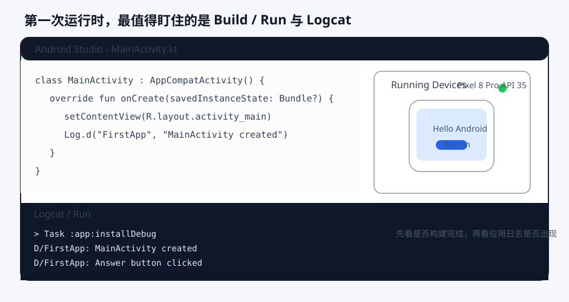
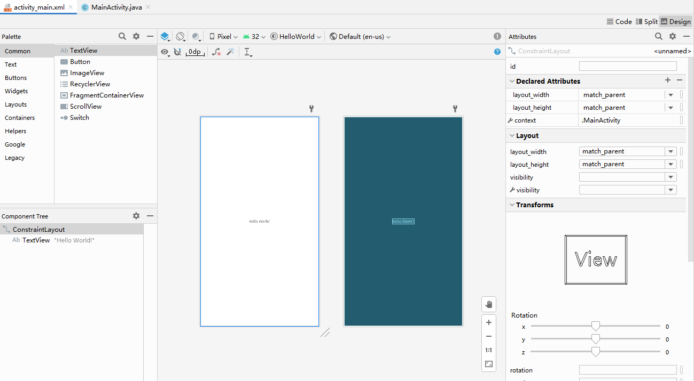

# 第一个 Android 应用

环境搭好之后，最重要的不是立刻做复杂功能，而是用一个足够小、足够完整的应用把整个开发闭环走一遍。所谓“第一个 Android 应用”，真正要完成的不是界面本身，而是这条闭环：创建工程、理解最基础的项目骨架、运行到设备、修改界面、再次安装并观察变化。只要这条链路真正跑通，后面再学生命周期、布局、数据和网络，读者都会更有抓手。

这一章的价值，在于把前一章的“环境可用”真正转化成“工程跑起来了”。很多人卡在这里，不是因为模板太难，而是因为一上来就往工程里塞复杂需求，结果一旦运行失败，就完全无法判断问题来自环境、项目配置、页面代码还是业务逻辑。本章会刻意把目标压得很小，让读者先学会完成一次稳定的最小迭代，再去接受更复杂的应用结构。

## 学习目标

- 创建并运行一个最小 Android 应用。
- 理解最小应用由哪些核心文件构成。
- 完成一次从修改代码到在设备上看到效果的完整迭代。
- 建立“应用不是孤立代码，而是资源、清单和构建共同作用”的第一层认知。

## 前置知识

- 已完成开发环境搭建。
- 已了解 Activity 作为界面入口的基本概念。

## 正文

### 1. 为什么第一个应用一定要足够小

入门时最常见的错误之一，就是把“第一个应用”理解成“第一个小项目”。于是很多读者会在刚创建工程之后，立刻加入登录、网络请求、多页面跳转、列表、数据库，甚至主题切换。这样做的问题不在于野心太大，而在于还没有建立任何可用于判断问题来源的基线。只要运行失败，就不知道自己到底该先看设备、看构建日志，还是看页面代码。

因此，第一个应用的目标应该非常克制。它不需要功能丰富，只需要完成三件事：能创建出来，能运行起来，能在修改后把变化稳定显示在设备上。这三件事一旦做通，后面每一章新增的知识点都可以叠加在同一条闭环上，而不是每学一个主题就重新摸索一次开发流程。

### 2. 新建工程时，实际上在决定什么

当在 Android Studio 中点击 New Project 时，IDE 并不是“帮你生成一个能跑的黑盒”，而是在让你做几项非常基础的工程决策。你会给应用命名，确定包名，选择保存位置，选择语言和最小支持版本，并从若干模板中挑出最接近当前学习目标的起点。

这里最值得把握的，不是某个字段应该填什么固定值，而是每个字段分别属于哪一层。应用名称更偏向用户可见层；包名更偏向工程唯一标识；语言和模板决定你得到什么样的起始代码；最小支持版本影响哪些设备和 API 能被覆盖。现在不需要把这些配置背熟，但要知道它们不是随便填的表单，而是 Android 工程的第一组边界。

对于本章这样的入门练习，最合适的模板通常是“单 Activity、单屏幕、默认结构尽量少”的最小模板。不同 Android Studio 版本里，模板名称可能略有变化；有的默认使用 Jetpack Compose，有的仍提供 Views/XML 版本。这里最重要的不是模板叫法，而是你最终会得到一个可运行的 `app` 模块和一个明确的页面入口。

### 3. 模板工程到底为你准备了什么

一个最小 Android 工程创建完成后，至少会出现四类关键内容。第一类是入口 Activity，用来承接应用打开后的第一个界面。第二类是资源文件，例如字符串、图标、主题或布局定义。第三类是 `AndroidManifest.xml`，它告诉系统这个应用有哪些关键声明。第四类是构建脚本，它告诉工具链如何把这些代码和资源组装成可安装产物。

从这一刻开始，读者就应该意识到：Android 应用不是靠一个 `main()` 函数启动的普通脚本。系统进入应用，要经过 Manifest 中声明的组件入口；页面显示效果，不一定都写在 Kotlin 文件里；应用能否安装和运行，也依赖构建脚本和 SDK 配置。稍后对欢迎文本做一次看似很小的修改，往往就会跨越代码、资源和构建三层内容。这正是 Android 工程化思维的第一课。

Big Nerd Ranch 在 `GeoQuiz` 这个入门例子里，刻意把第一个应用收缩成“一个 `Activity`、一个布局、两个判断按钮”的最小组合。它先让读者在 `MainActivity`、`activity_main.xml`、`strings.xml` 和 `AndroidManifest.xml` 之间来回定位入口，再通过按钮点击与 `Toast` 反馈把页面、资源和运行结果连成一条线。这种顺序很值得借鉴，因为它把第一个应用的目标固定在识别工程骨架与跑通最小闭环上，而不是一开始就堆更多功能。

`Android Application Development Cookbook, 2nd Edition` 还补了一个很适合初学者建立“模板不是黑盒”直觉的小切口：书里明确指出，Android Studio 向导创建项目后会自动生成 `res/layout/activity_main.xml`，再在 `onCreate()` 里通过 `setContentView(R.layout.activity_main)` 把这份布局真正挂到屏幕上；后面的示例甚至直接切到 `activity_main2`，用第二套布局证明“页面显示出来”本质上就是布局资源被显式加载的结果。这个例子很适合放在本章，因为它能帮助读者把“IDE 自动生成的欢迎界面”拆回到看得见的文件和方法调用。

### 4. 第一次点击 Run 时，背后发生了什么

第一次点击运行按钮时，Android Studio 背后会完成一整条链路：读取当前运行配置，检查目标设备是否可用，执行 Gradle 构建任务，生成本地安装产物，把它部署到模拟器或真机上，然后请求系统启动默认入口 Activity。对初学者来说，这个过程看起来像“只点了一下按钮”，但它其实已经包含了 Android 开发最核心的工作流。

理解这条链路非常重要，因为后面无论项目复杂到什么程度，本质上都还是同一条流程在工作。今天运行的是一个只有一屏内容的最小应用，未来运行的是包含多个模块、多个页面和网络依赖的项目，构建、安装、启动和验证这几个阶段都不会消失。第一个应用的意义，就在于先把这条主链路走熟。

第一次运行往往也会明显比后续慢，这是正常现象。因为首轮构建通常伴随依赖解析、Gradle 配置、代码编译、资源处理、模拟器冷启动或首次安装。初学者很容易把“第一次比较慢”误判成“工程出了问题”，于是反复重新创建项目。更稳妥的做法是先看 Build 输出和设备状态，分清它是在正常构建，还是确实卡在某个失败点。

Big Nerd Ranch 在第一次运行 `GeoQuiz` 时还专门提醒读者观察两件事：模拟器首轮启动可能明显偏慢；一旦应用在启动或按钮点击时崩溃，就应立即去 `Logcat` 按 `MainActivity` 过滤异常。这正好对应本章想建立的基本习惯：第一次运行不是只盯着屏幕有没有显示，而是把构建、安装、启动和日志反馈一起纳入同一条调试链路。

如果把第一次运行时最该看的工作区摆在一起，会更容易建立“先看哪一层出问题”的直觉。编辑区负责改代码，运行设备负责确认界面是否真的出现，底部的 Run 和 Logcat 则负责告诉你构建有没有完成、页面有没有真正启动。



图：Android Studio 的 Run 与 Logcat 工作台示意。第一次运行时，屏幕变化只是结果，真正帮助定位问题的是底部的构建输出和当前进程日志是否同时成立。

### 5. 第一轮改动，应该改什么最有价值

第一次修改应用时，最有价值的改动不是“新增功能”，而是做一组能帮助读者认识工程边界的最小变化。通常来说，第一轮改动最好同时覆盖文本、界面和日志这三个入口。

文本改动能让人意识到，用户看到的字符串并不一定直接写在 Kotlin 代码里；界面改动能让人开始区分布局、Compose 代码和主题资源的职责；日志改动则能帮助建立运行时观察习惯，而不是只看屏幕有没有变化。只要这三个入口都摸过一遍，对最小工程的理解就会比单纯“把模板跑起来”稳得多。

如果当前使用的是 Views/XML 模板，第一次最常接触到的工作区通常就是布局编辑器。它会把组件树、设计预览和属性面板放到同一个界面里，帮助把“屏幕上的变化”和“工程里的文件落点”对应起来。



图：Views/XML 模板下的布局编辑器示意。具体控件和工具栏会随 Android Studio 版本变化，但组件树、画布预览和属性面板这三块职责基本稳定。

### 6. 最小示例：把欢迎文本改成自己的内容

不同模板的首屏写法可能不同，但第一轮 UI 改动的目标其实一致：找到模板生成的欢迎文本，把它替换成自己的内容，然后重新运行，确认设备上已经出现变化。

如果使用的是 Views/XML 模板，通常会在字符串资源或布局文件里找到对应文本：

```xml
<!-- app/src/main/res/values/strings.xml -->
<resources>
    <string name="app_name">FirstApp</string>
    <string name="welcome_message">你好，Android</string>
</resources>
```

如果使用的是 Compose 模板，欢迎文本通常会直接出现在 `MainActivity.kt` 或某个 `@Composable` 函数中：

```kotlin
Text(text = "你好，Android")
```

这两个例子背后的教学点是一样的：要学会沿着“屏幕上的内容”反向追踪到它在工程里的真实来源。运行成功之后，不要只满足于看到界面变了，还要进一步回答自己两个问题：改的是代码还是资源；如果下次要改颜色、间距或点击行为，该去哪个文件找入口。

### 7. 现在就该认识 Logcat

很多教程喜欢把日志放到更后面再讲，仿佛那是调试阶段才需要的内容。实际上，第一个应用阶段就应该建立 Logcat 习惯。原因很简单：只要应用没有按预期运行，屏幕上的现象往往不够说明问题，而日志是能直接接触到的第一手运行反馈。

这一章不要求掌握复杂过滤语法，但至少要会做两件事。第一，知道如何把 Logcat 的进程或包名切换到当前应用。第二，知道在 `MainActivity` 中加入一条简单日志后，去哪里确认它真的被打印出来。只要这个习惯形成，后面遇到崩溃、生命周期顺序异常、网络请求失败时，就不会只靠猜测。

### 8. 学完这一章后，应该具备什么能力

第一个应用之后，不需要立刻会写复杂业务，也不需要马上理解整个 Android 架构。但至少应该具备以下能力：知道如何创建一个新工程；知道如何把应用稳定运行到设备；知道屏幕上的一个改动可能对应哪些文件；知道运行失败时先看构建输出还是先看 Logcat。只要这几项能力建立起来，就已经从“安装了工具”进入了“能开始开发”的阶段。

这也是为什么本章要把目标压得很小。真正重要的不是模板有多漂亮，而是第一次把工程、设备和代码变化连成了一条完整闭环。

### 9. 把 codelab 当作开发闭环训练

第一个应用最适合借助 first app codelab，因为它会强迫读者按“创建项目 -> 运行 -> 修改 -> 再运行 -> 验证结果”的顺序走完一次最小迭代。但 codelab 只负责训练节奏，不负责代替你理解工程结构。本章的重点仍然是把 Activity、资源、Manifest 和构建脚本放回同一条运行链路里。

更稳妥的做法是：先照 codelab 跑通一次，再离开教程独立复现一次。如果第二次仍然能解释自己动了哪些文件、为什么设备上会出现变化，这一章才算真正落地。附录里的资料地图会继续说明后续该回哪类本地资料，不需要在这里继续展开更多书单。

如果把按钮点击、`Toast` 和启动日志放进同一个最小 Activity，第一个应用的闭环会更完整。

```kotlin
class MainActivity : AppCompatActivity() {

    override fun onCreate(savedInstanceState: Bundle?) {
        super.onCreate(savedInstanceState)
        setContentView(R.layout.activity_main)

        Log.d("FirstApp", "MainActivity created")

        val welcomeText = findViewById<TextView>(R.id.welcomeText)
        val answerButton = findViewById<Button>(R.id.answerButton)

        welcomeText.text = getString(R.string.welcome_message)
        answerButton.setOnClickListener {
            Toast.makeText(this, R.string.answer_feedback, Toast.LENGTH_SHORT).show()
            Log.d("FirstApp", "Answer button clicked")
        }
    }
}
```

```xml
<resources>
    <string name="welcome_message">你好，GeoQuiz</string>
    <string name="answer_feedback">按钮点击成功</string>
</resources>
```

这组代码之所以很适合放在第一支 App 里，是因为它把“模板能跑”推进成了“我知道一处可见变化、一处即时反馈和一条运行日志分别落在哪”。`TextView` 变化帮你确认资源和界面已经连起来，`Toast` 帮你确认事件回调真的触发了，`Log.d(...)` 则让你第一次把屏幕现象和运行时反馈连接到一起。第一个应用最该建立的，不是功能量，而正是这种最小但完整的观察闭环。

Big Nerd Ranch 的 `GeoQuiz` 之所以常被拿来做入门示例，也正因为它把第一轮实践控制在“Activity 入口、布局资源、按钮点击、即时反馈”这几条最小主线上。只要这几条主线站稳，后面再往里加 Fragment、列表、导航和数据层时，读者始终都有一条已知稳定的基线可以回退。

### 10. 最小实践任务

起点条件：

- 已完成上一章的环境验证。
- 已拥有一个可运行的模拟器或真机。

步骤：

1. 在 Android Studio 中创建一个单 Activity 的最小工程。
2. 完成第一次运行，确认应用能稳定安装并启动到设备。
3. 找到模板中的欢迎文本，把它修改成自己的内容。
4. 在入口 Activity 中加入一条简单日志，例如记录“应用已启动”。
5. 打开 first app codelab，对照检查自己的工程是否也完成了“创建项目、运行、修改、再次运行”这条闭环。
6. 再次运行应用，确认界面文本变化已经生效，并在 Logcat 中找到这条日志。

预期结果：

- 设备上能看到改过的欢迎文本。
- Logcat 里能定位到入口 Activity 打出的日志。
- 读者应能说明：codelab 在这里解决的是练习顺序问题，而不是取代工程原理解释。
- 读者应能说清这次改动分别动到了哪个文件。

自检方式：

- 关闭应用重新打开后，欢迎文本仍是新的内容，而不是模板默认值。
- 运行按钮执行后没有停留在“安装失败”或“无设备可用”。
- 读者应能指出日志来自 Kotlin 代码，而文本可能来自资源或 Compose/UI 代码。
- 读者应能在不看教程步骤的情况下，再独立复现一次这条最小流程。

调试提示：

- 如果界面没有变化，先确认修改的是当前运行的模块和当前设备上的最新安装版本。
- 如果日志看不到，先检查 Logcat 是否过滤到了错误进程或错误日志级别。
- 如果应用根本没启动，先回到上一章的环境链路，确认构建和设备连接都正常。
- 如果发现自己只能“跟着做”却说不清文件职责，先回到本章第 3、4 节，不要继续堆功能。

### 11. 常见误区

- 在模板工程里一开始就堆复杂功能，导致问题来源无法判断。
- 只会点运行按钮，不知道背后经历了构建、安装和启动过程。
- 改了界面，却不知道文本、样式和行为分别来自哪里。
- 应用运行失败时不看日志，只反复重新运行。
- 把 first app codelab 当成“一次性跟做”，而不是最小开发闭环的训练模板。

## 练习题

1. 概念理解题：为什么第一个 Android 应用的目标应该是跑通“创建、运行、修改、再次运行”的闭环，而不是一开始就堆更多功能？
2. 编码实现题：分别在 Views/XML 模板和 Compose 模板里，把欢迎文本改成自己的内容，并写下这次改动分别落在哪些文件中。
3. 拓展思考题：如果第一次运行失败，你会按什么顺序排查设备、构建输出、页面入口和 Logcat？为什么这样排更容易定位问题？

## 小结

第一个 Android 应用的真正价值，不是做出了一个简单页面，而是让读者完成了第一次完整开发闭环：创建工程、理解最小结构、运行到设备、做出修改、观察结果并从日志确认运行状态。这一步一旦走通，后面每学一个新主题，都能落回同一条稳定工作流，而不是重新从“项目怎么跑起来”开始摸索。

下一章将顺着这条闭环继续往里拆，去看一个最小 Android 工程到底由哪些目录和文件组成，以及这些文件为什么会这样组织。

## 参考资料

- 参考并改写自：Bill Phillips、Chris Stewart、Kristin Marsicano、Brian Gardner，《Android Programming: The Big Nerd Ranch Guide, 5th Edition》(2022)，第 1 章。
- 参考并改写自：Neil Smyth，《Android Studio Narwhal Essentials》(2025)，创建首个项目、运行应用与 Android Studio 工具窗口相关章节。

- 参考并改写自：Rick Boyer、Kyle Mew，《Android Application Development Cookbook, 2nd Edition》(2016)，项目模板、`activity_main.xml` 与 `setContentView()` 相关 recipes。
- 创建第一个 Android 应用：<https://developer.android.com/training/basics/firstapp/creating-project.html>
- 创建项目：<https://developer.android.com/studio/projects/create-project>
- 构建与运行应用：<https://developer.android.com/studio/run/index.html>
- Build your first Android app：<https://developer.android.com/codelabs/build-your-first-android-app-kotlin>
- Android Basics with Compose：<https://developer.android.com/courses/android-basics-compose/course>
