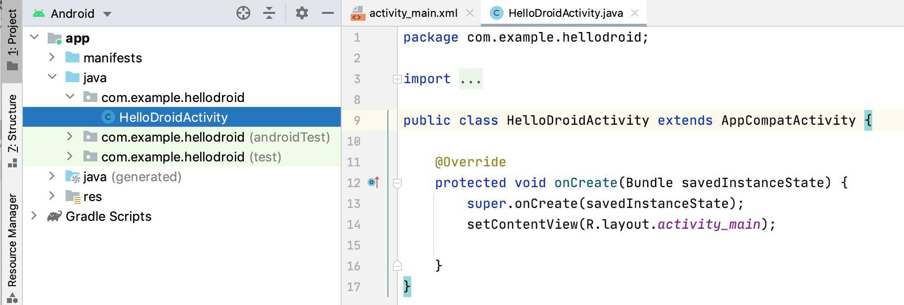

# Android 项目结构

跑通第一个应用之后，很多人会立刻遇到第二个问题：工程里为什么会有这么多目录和文件，它们到底各自做什么。如果这一层没有尽早理顺，后面学习布局、导航、数据和构建时就会长期处于“知道要改文件，但不知道为什么在这里改”的状态。本章的任务，就是把最小 Android 项目的结构拆清楚，让你对工程组织形成稳定认知。

项目结构这一章的重要性，往往被低估。初学者常常能照着教程改出界面、改出文本、甚至改出一个列表，但一旦教程之外的问题出现，例如“应用名该在哪里改”“依赖该加到哪一层”“为什么有的资源找不到”“为什么 IDE 里看到的目录和磁盘上不一样”，就会立刻失去方向。本章要解决的，正是这种“会跟做，但不会定位文件”的问题。

## 学习目标

- 理解 Android 项目中最常见目录和文件的职责。
- 知道代码、资源、清单和构建脚本为什么要分开管理。
- 建立从“看目录”到“理解工程边界”的基本能力。
- 为后续布局、资源、导航和构建章节打基础。

## 前置知识

- 已完成第一个 Android 应用。
- 已知道工程至少包含 Activity、布局文件、Manifest 和 Gradle 配置。

## 正文

### 1. 为什么 Android 项目天然比普通脚本目录复杂

一个普通命令行程序，可能只需要几个源文件就能表达全部逻辑。但 Android 应用不是这样，因为它同时要管理业务代码、界面资源、图片图标、主题样式、清单声明、构建配置、测试代码和可能存在的多环境差异。目录复杂，并不是因为 Android “喜欢堆文件”，而是因为移动应用本身就是多种内容共同参与的系统工程。

一旦你从这个角度看项目结构，很多目录就不再显得神秘。某个文件不放在 Kotlin 源码目录里，并不意味着它不重要；恰恰相反，像 `AndroidManifest.xml`、`res/` 和构建脚本这样的文件，往往决定了系统如何识别你的应用、资源如何被组织、工具如何把项目打包出来。项目结构不是装饰，它就是工程边界本身。

### 2. 先分清项目根目录和 `app` 模块

大多数初学者第一次打开 Android 工程时，会同时看到项目根目录和一个叫 `app` 的模块目录。项目根目录更像整个工程的外壳，用来放多模块共享配置、Gradle 包装器、设置文件和一些顶层说明；而 `app` 模块才是当前最小应用真正的主体，里面包含源码、资源、Manifest 和模块级构建脚本。

把这个边界分清楚之后，你会更容易回答很多实际问题。例如，“我要加一个依赖，应该改项目级还是模块级脚本”“为什么我改了根目录的某个文件，应用行为却没有变化”“以后如果增加第二个功能模块，它和 `app` 是什么关系”。对于目前这一阶段来说，你至少要知道：绝大多数直接影响应用运行结果的内容，都在 `app` 模块里；根目录更多是在决定“这个工程如何被 Gradle 识别、组合和构建”。

现代 Android 工程里，根目录还常常会出现几类需要尽早认出的文件。`settings.gradle.kts` 负责声明这个工程包含哪些模块，以及插件管理从哪里解析；`gradle.properties` 常用来放构建开关和共享参数；`gradle/` 与 `gradlew`、`gradlew.bat` 共同决定团队是否能在一致的 Gradle 环境下构建项目；不少模板还会引入 `gradle/libs.versions.toml` 来集中管理依赖版本。你现在不需要立刻精通这些文件，但要先知道：它们虽然不直接承载界面或业务代码，却在决定工程是否可同步、可编译、可扩展。

### 3. 读懂一个最小 Android 工程的主干目录

下面是一棵典型的最小工程主干目录。不同模板和 Android Studio 版本会有细微差异，但主线通常相近。

```text
project-root/
├─ app/
│  ├─ src/
│  │  ├─ main/
│  │  │  ├─ kotlin/ 或 java/
│  │  │  ├─ res/
│  │  │  └─ AndroidManifest.xml
│  │  ├─ test/
│  │  └─ androidTest/
│  └─ build.gradle.kts
├─ gradle/
├─ settings.gradle.kts
└─ gradlew / gradlew.bat
```

如果你使用的是 Compose 模板，`res/layout/` 目录可能一开始并不存在，因为布局更多写在 Kotlin 代码中。但这不影响你理解结构主线：逻辑代码在源码目录，资源在 `res/`，系统声明在 Manifest，构建行为在 Gradle 脚本。模板差异改变的是起始实现方式，而不是工程边界。

### 4. `src/main` 下的内容分别解决什么问题

`src/main/kotlin` 或 `src/main/java` 放的是主要业务代码和组件代码，例如 Activity、Fragment、ViewModel、Repository 等。它解决的是“应用逻辑如何表达”的问题。你想加入点击事件、网络请求、状态流转或页面逻辑，通常都会先进入这一层。

`src/main/res` 放的是资源文件，例如布局、字符串、颜色、图片、主题和图标。它解决的是“界面和静态资源如何管理”的问题。Android 官方文档也明确建议把字符串和图片等资源从代码中外置出来，以便后续独立维护和提供不同配置下的替代资源。也就是说，`res/` 不是附属目录，而是 Android 项目的核心组成部分。

`src/main/AndroidManifest.xml` 是系统层面对应用的描述文件。应用入口、权限、主题、组件可见性、某些 intent filter 等关键声明都要在这里体现。后面你会学到：很多平台能力不是“代码写出来就能用”，而是必须在 Manifest 中明确告知系统。

### 5. 测试目录和构建脚本为什么也要尽早认识

即使你现在还没正式进入测试章节，也应该先知道 `src/test` 和 `src/androidTest` 的存在。前者更适合放不依赖设备的本地单元测试，后者更适合放需要在 Android 运行环境中执行的测试。现在不要求你立即写测试，但至少要知道它们为什么和 `main` 分开，以及后续测试不会和业务代码混在一起。

模块目录里的 `build.gradle.kts` 则承担另一项关键职责：声明插件、Android 配置、依赖和构建相关参数。它不是“最好别碰的黑盒”，而是项目能否正确构建的正式入口之一。你后面学习依赖管理、构建变体和打包流程时，会频繁回到这里。现在先建立一个基本认知就够了：功能代码写在源码目录，构建行为写在 Gradle 脚本里，这两者不要混淆。

和它们一起出现、但不应该被手工维护的，还有 `build/` 这类生成目录。Gradle 同步、编译、资源处理和代码生成后，往往会在模块下产生中间产物、缓存和打包输出。初学者有时会在 IDE 里看到这些目录，于是误以为“这些也是项目结构的一部分，需要自己去改”。更稳妥的认知是：生成目录是构建结果，不是源码边界。你要修改行为，通常应回到源码、资源、Manifest 或构建脚本，而不是直接改 `build/` 里的内容。

### 6. 为什么 IDE 里的项目视图和磁盘目录不完全一样

Android Studio 为了提高可读性，会在 Project 视图或 Android 视图里对目录进行重组、折叠和逻辑化展示。这样做对日常开发很方便，但也容易让初学者误以为 IDE 里看到的结构就是磁盘上的真实结构。等到你在终端里查文件、看构建输出、处理资源路径时，这种误解就会暴露出来。

在 Android 视图里，IDE 通常会把 `manifests`、`java`、`res` 和 `Gradle Scripts` 重新组织成更适合日常阅读的分组，如下面的示意图所示。



图：Android Studio 的 Android 视图示意。这个视图便于定位文件，但它不是磁盘上的真实目录结构。

因此，项目结构学习有一个关键过渡：先用 IDE 视图帮助自己定位文件，再逐步建立“这些文件在磁盘上到底放在哪”的真实认知。只有这样，后面你处理脚本、资源、生成代码和版本控制时，才不会被 IDE 的友好展示误导。

### 7. 用一次真实改动理解“文件应该改哪里”

项目结构最容易学偏的地方，在于把目录当成要记忆的名词表。更有效的学法，是拿一个真实改动来追踪文件落点。比如你想把首页标题从默认文本改成新的欢迎语，这通常会落到字符串资源或 UI 代码里；如果你还想改应用名称，可能要看字符串资源和 Manifest；如果你准备引入一个第三方库，则应进入模块级 `build.gradle.kts`。

这个例子说明，真正有价值的问题不是“`res` 目录里都有什么”，而是“当我要做某类变更时，应该先去哪里找”。目录认知一旦和真实改动关联起来，就不再只是背结构，而是开始形成工程判断能力。

你可以把这种判断方式概括成一条很实用的路线：先判断这次变更属于“代码逻辑”“界面资源”“系统声明”“构建配置”还是“测试验证”，再去相应目录里定位文件。只要这条路线建立起来，后面即使工程从单模块增长到多模块，你也不会每次都从整个仓库里盲找文件。

### 8. 一个健康项目结构应具备什么特征

一个好的项目结构，通常不是“目录越多越专业”，而是边界足够清晰、命名足够稳定、扩展时能快速找到合适落点。读者现在虽然还处在最小工程阶段，但也应尽早形成这种判断标准：代码不要无节制地堆在同一个包里，资源命名不要随意，Manifest 变更要有意识，构建脚本也要知道自己为什么在改它。

后面随着工程增长，你会逐步接触 `ui`、`data`、`domain`、`feature` 等更清晰的分层方式。但那是建立在当前这层目录边界已经清楚的基础之上的。如果连 `src/main`、`res`、Manifest 和模块脚本的职责都没有理顺，再谈架构目录只会变成形式主义。

### 9. 最小实践任务

起点条件：

- 已创建并运行一个最小 Android 工程。

步骤：

1. 打开项目根目录和 `app` 模块，分别确认它们负责什么。
2. 在 `app/src/main` 下定位源码目录、`res/` 目录和 `AndroidManifest.xml`。
3. 找到模块级 `build.gradle.kts`，读出其中至少一项你能理解的配置，例如应用 ID、依赖或 `minSdk`。
4. 完成两个小改动：修改首页标题文本，以及修改应用显示名称。
5. 记录这两个改动分别涉及了哪些文件，并写一句话解释原因。

预期结果：

- 你能在不依赖教程截图的前提下，自行定位常见文件。
- 你能说清一次界面改动为什么会同时涉及资源、代码或清单。
- 你开始建立“变更类型和文件落点”之间的对应关系。

自检方式：

- 当别人问你“应用名在哪里改”或“页面文本在哪里改”时，你能给出明确目录，而不是笼统回答“在项目里找”。
- 你能区分项目根目录配置和 `app` 模块配置，不再把它们混成一层。

调试提示：

- 如果找不到布局目录，先确认当前模板是否使用 Compose；这并不代表项目结构异常。
- 如果改了字符串却没有生效，先确认界面是否真的引用了该资源，而不是写死在代码里。
- 如果改动涉及构建脚本后项目报错，优先看 Gradle Sync 输出，不要先怀疑 UI 代码。

### 10. 常见误区

- 把所有问题都当成“代码问题”，忽视资源和 Manifest 的边界。
- 只会在 IDE 里点文件，不知道磁盘上的真实目录结构。
- 项目一大就把所有类堆进同一个包。
- 把构建脚本当成完全不能碰的黑盒。

## 小结

本章要建立的，不是对目录名的机械记忆，而是对工程边界的直觉。只要你能把源码、资源、Manifest、测试目录和构建脚本这几类内容分清，后面学习布局、导航、数据和构建系统时，就不会一直停留在“知道现象、不懂文件落点”的状态。

下一章开始，我们会进入 Android 平台最核心的主题之一：Activity 生命周期。到那时，你会第一次真正感受到“页面不是线性执行脚本”这件事对代码组织意味着什么。


## 参考资料

- 参考并改写自：Bill Phillips、Chris Stewart、Kristin Marsicano、Brian Gardner，《Android Programming: The Big Nerd Ranch Guide, 5th Edition》(2022)，“The Necessary Tools”、第 1 章与资源组织相关章节。
- 参考并改写自：Neil Smyth，《Android Studio Narwhal Essentials》(2025)，项目创建、工具窗口、Gradle 与项目文件结构相关章节。

- 应用资源概述：<https://developer.android.com/guide/topics/resources/providing-resources>
- 创建项目：<https://developer.android.com/studio/projects/create-project>

