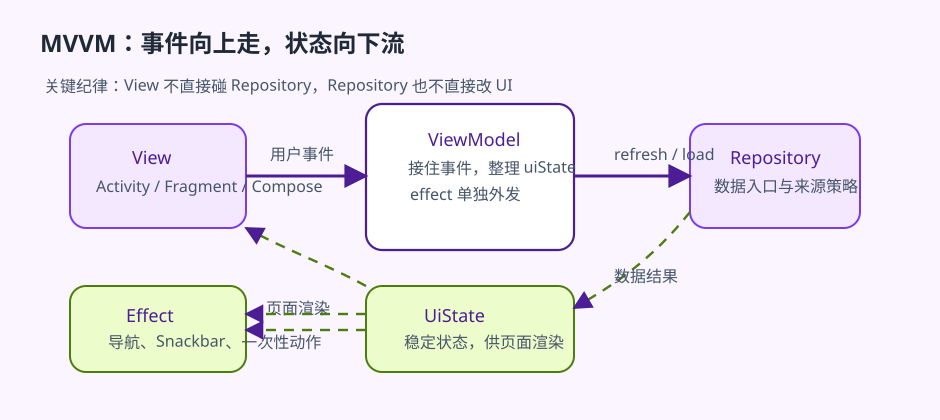

# Android 中的 MVVM

上一章解决的是“为什么现代 Android 更常采用 MVVM”，这一章开始回答另一个更实在的问题: 它在代码里到底怎样落地。很多开发者知道 `View`、`ViewModel`、`Model` 这三个词，却很难把它们和 Activity、Fragment、Compose、Repository、Room、网络接口这些现实对象对应起来。结果往往是，概念上似乎已经在用 MVVM，代码上却仍然由页面类承担大部分复杂度。

这章的重点不是再解释一遍缩写，而是把 MVVM 还原成 Android 项目里的职责链路。你会看到它为什么总和单向数据流、页面状态、Repository、`StateFlow` 一起出现，也会看到它并不是“把所有逻辑都搬进 ViewModel”这么简单。

## 学习目标

- 理解 `View`、`ViewModel`、`Model` 在 Android 项目中的真实落点。
- 理解 MVVM 在页面状态组织、数据流方向和生命周期协作上的优势。
- 理解为什么 `uiState` 是 MVVM 在 Android 中最重要的落地形式之一。
- 为后续 `Repository`、`UseCase`、`Hilt` 等章节建立统一语境。

## 前置知识

- 已理解 MVC、MVP、MVVM 的整体差异。
- 已接触 Activity、Fragment、Compose 和 ViewModel。

## 正文

### 1. 先从一个实际页面开始，而不是从三层定义开始

假设你正在做一个新闻列表页。页面打开后要拉取数据，支持搜索、收藏、下拉刷新、错误重试和跳转详情。到了这个复杂度，最关键的问题已经不是“页面能不能跑”，而是:

- 搜索关键字放哪儿。
- 加载中和错误态由谁持有。
- 网络和本地数据由谁协调。
- 页面重建后状态由谁接住。

MVVM 的价值，就是给这些问题提供一套稳定分工。

### 2. View 在 Android 里不是“布局文件”，而是整块显示层

在 MVVM 中，`View` 指的不是 XML 文件本身，而是用户直接面对的那层界面呈现系统。在 Android 里，它通常包括:

- Activity 或 Fragment。
- Compose 的 screen-level composable。
- 负责渲染、事件收集和部分纯 UI 反馈的代码。

`View` 的职责应该尽量聚焦于两件事:

- 把当前状态显示出来。
- 把用户动作转成事件往上交。

这意味着 View 不应直接承担网络请求、数据库协调和长期状态持有。它可以很忙，但不应该很重。

### 3. ViewModel 是 MVVM 在 Android 中真正站稳的关键

如果没有 `ViewModel`，MVVM 在 Android 里往往会变成一套概念，而不是稳定结构。原因很简单: Activity 和 Fragment 的实例生命周期并不稳定，但页面状态不能跟着它们一起随意丢失。

`ViewModel` 在 Android 中最重要的价值，就是提供了一个屏幕级状态持有点。它更适合承接:

- 页面当前的 `uiState`。
- 搜索词、筛选条件、分页位置等页面语义状态。
- 页面触发的加载、刷新、重试、提交等行为组织。

它不是为了“替页面多活一会儿”，而是为了让页面状态和页面实例解耦。

### 4. Model 在现代 Android 中往往是一整块数据与规则层

很多人会把 `Model` 误解成“几个 data class”。在现代 Android 项目里，这个理解太窄。更真实的情况通常是:

- `Repository` 负责对外提供统一数据入口。
- 本地数据源和远程数据源负责各自访问。
- 映射逻辑把 DTO、Entity、UI model 区分开。
- 某些业务规则或用例负责封装跨页面可复用逻辑。

也就是说，`Model` 在真实项目里通常是一整块数据与规则体系，而不是几个单纯的数据对象。

### 5. Android 中一条健康的 MVVM 链路长什么样

更符合现代 Android 的 MVVM 链路通常是这样:

1. View 收到用户动作，例如点击刷新或输入搜索词。
2. View 把动作交给 ViewModel。
3. ViewModel 调用 Repository 或 UseCase。
4. 数据层协调本地、远程、缓存和错误处理。
5. ViewModel 把结果转换为页面可消费的 `uiState`。
6. View 只根据 `uiState` 渲染。

这条链路的关键不是“谁调用谁”，而是状态从上游一路被整理，直到页面只面对一个清晰的状态出口。

### 6. 单向数据流为什么几乎总和 MVVM 一起出现

只要项目走到 MVVM，迟早都会遇到单向数据流。原因很现实: 如果页面、ViewModel、Repository 都在同时修改同一份状态，状态来源会很快失控。

更稳的方式通常是:

- 事件向上流: View -> ViewModel。
- 数据结果向内流: 数据层 -> ViewModel。
- 页面状态向下流: ViewModel -> View。

这样做的好处不是“理论更优雅”，而是你终于能解释清楚: 这次页面为什么变了，是谁触发的，变化经过了哪些层。

如果把这条流动关系直接画出来，MVVM 在 Android 里就不再像一个抽象缩写，而会更接近每天都在维护的页面结构。图里最值得记住的不是类名，而是流向：事件往上交，数据在中间整理，最终由稳定状态向下驱动界面。



图：MVVM 单向数据流图。View 负责把用户动作交给 ViewModel，Repository 负责提供数据能力，`uiState` 和 `effect` 则分别承担稳定渲染和一次性动作，不应该混成同一个出口。

### 7. `uiState` 是 MVVM 落地的关键接口，不是附属写法

很多团队说自己在用 MVVM，但页面仍然靠多个布尔值、若干独立 LiveData 或一堆可变字段来驱动。这样的状态结构很容易碎掉，因为页面并没有一个真正稳定的“当前状态”模型。

更可维护的做法通常是把页面状态正式建模成一个 `UiState`:

```kotlin
data class ArticleListUiState(
    val isLoading: Boolean = false,
    val query: String = "",
    val items: List<ArticleUiModel> = emptyList(),
    val errorMessage: String? = null
)
```

这样做的意义在于，页面终于可以围绕“当前状态是什么”来思考，而不是围绕“现在该去改哪几个字段”来思考。

与这件事配套的，还有“只暴露只读状态”的纪律。ViewModel 内部可以维护 `MutableStateFlow` 或其他可变状态容器，但对外更稳妥的接口通常应该是 `StateFlow<UiState>` 或其他只读视图。这样做不是形式主义，而是在明确：页面负责消费状态，不负责绕过 ViewModel 直接改状态。

Luca Vainigli 在一个很简洁的 `ArticleRepository -> ArticleViewModel -> ArticleListScreen` 例子里，把这层接口压得很实：`ArticleRepository(private val dataSource: ArticleDataSource)` 负责取文，`ArticleViewModel` 内部维护 `private val _articles = MutableStateFlow(emptyList<Article>())`，只向外暴露 `StateFlow<List<Article>>`，Compose 端的 `ArticleListScreen(viewModel: ArticleViewModel = viewModel())` 则通过 `viewModel.articles.collectAsState(emptyList()).value` 渲染列表。这个例子看似简单，却正好说明了 MVVM 的关键纪律：数据源不碰 UI，Composable 不直连数据源，ViewModel 和界面之间只通过可观察状态交换信息。

### 8. View 应该轻到什么程度

“页面要轻”这句话很容易说空。更具体一点，View 可以负责:

- 绑定 UI 和生命周期。
- 读取并渲染 `uiState`。
- 收集点击、输入、滑动、刷新等事件。
- 执行导航、权限请求、打开系统选择器这类纯 UI 动作。

但 View 不应负责:

- 直接访问网络和数据库。
- 维护长期业务状态。
- 同时协调多个数据来源。
- 解释底层错误并决定业务策略。

只要这些职责还留在页面里，MVVM 就还没有真正站稳。

### 9. ViewModel 也不是“新的业务垃圾桶”

MVVM 在 Android 中最常见的误用，就是把所有复杂度从页面类挪到 ViewModel。这样做短期看似清爽，长期只是把巨型 Fragment 变成巨型 ViewModel。

更合理的边界是:

- ViewModel 组织页面状态。
- Repository 组织数据入口和来源策略。
- UseCase 组织跨页面可复用的业务动作。

如果 ViewModel 里塞满 SQL 细节、HTTP 细节、复杂对象装配和无关页面的业务规则，说明你不是在落实 MVVM，而是在转移混乱。

### 10. 一个最小的 MVVM 页面结构

下面这个例子展示的是 MVVM 在 Android 中更接近真实项目的最小形态:

```kotlin
class ArticleListViewModel(
    private val repository: ArticleRepository
) : ViewModel() {

    private val _uiState = MutableStateFlow(ArticleListUiState(isLoading = true))
    val uiState: StateFlow<ArticleListUiState> = _uiState

    fun refresh() {
        viewModelScope.launch {
            _uiState.update { it.copy(isLoading = true, errorMessage = null) }
            when (val result = repository.refreshArticles()) {
                is ApiResult.Success -> {
                    _uiState.update {
                        it.copy(isLoading = false, items = result.data)
                    }
                }
                is ApiResult.Failure -> {
                    _uiState.update {
                        it.copy(isLoading = false, errorMessage = result.message)
                    }
                }
            }
        }
    }
}
```

这个例子最重要的不是语法，而是分工:

- 页面不直接处理 Repository。
- 页面不直接解释错误。
- 页面最终只消费 `uiState`。

这就是 MVVM 在 Android 中最有价值的部分: 把复杂页面重新收束成清晰状态。

《Thriving in Android Development Using Kotlin》里的聊天页又把这个结构往真实项目推了一步：`ChatViewModel` 同时暴露 `uiState: StateFlow<Chat>` 和 `messages: StateFlow<List<Message>>`，Compose 端用 `LaunchedEffect(Unit)` 触发初始化，再分别消费这两条状态流。作者之所以没有把所有东西硬塞进一个超大的状态对象，是因为聊天头部信息和消息流的变化频率完全不同。这个例子很适合提醒读者，MVVM 的重点不是“永远只有一个状态对象”，而是让状态边界和变化频率匹配，让 UI 知道该观察什么、为什么变化。

### 11. 稳定状态和一次性事件不能混在同一个 `uiState` 里

很多 MVVM 示例写到这里就停住了：ViewModel 暴露一个 `uiState`，页面去 collect 它，似乎问题已经解决。但真实页面很快会遇到另一类数据：跳转、Toast、Snackbar、一次性的错误提示、登录成功后打开主页。这些东西如果也硬塞进 `uiState`，页面重组、旋转或重新订阅时就很容易重复消费，最后变成“状态结构看起来统一，行为却越来越怪”。

`Clean Android Architecture` 在讲 `StateFlow`、`SharedFlow` 和 one-off event 时把边界说得很清楚：稳定状态适合放在 `StateFlow`，因为新订阅者应该拿到最后一个值；一次性事件则更适合放在 `SharedFlow` 或 channel，因为你通常不希望“上一次的跳转命令”在新页面实例里再自动重放。把这条边界放进 MVVM，页面结构会一下子稳定很多。

```kotlin
data class LoginUiState(
    val email: String = "",
    val isSubmitting: Boolean = false,
    val errorMessage: String? = null,
)

sealed interface LoginEffect {
    data object OpenHome : LoginEffect
    data class ShowSnackbar(val message: String) : LoginEffect
}

class LoginViewModel(
    private val repository: AuthRepository,
) : ViewModel() {
    private val _uiState = MutableStateFlow(LoginUiState())
    val uiState: StateFlow<LoginUiState> = _uiState.asStateFlow()

    private val _effects = MutableSharedFlow<LoginEffect>()
    val effects: SharedFlow<LoginEffect> = _effects.asSharedFlow()

    fun submit(email: String, password: String) {
        viewModelScope.launch {
            _uiState.update { it.copy(email = email, isSubmitting = true, errorMessage = null) }

            repository.login(email, password)
                .onSuccess {
                    _uiState.update { it.copy(isSubmitting = false) }
                    _effects.emit(LoginEffect.OpenHome)
                }
                .onFailure { error ->
                    _uiState.update {
                        it.copy(
                            isSubmitting = false,
                            errorMessage = error.message ?: "登录失败",
                        )
                    }
                    _effects.emit(LoginEffect.ShowSnackbar("请检查账号、密码或网络"))
                }
        }
    }
}

@Composable
fun LoginRoute(
    viewModel: LoginViewModel,
    onOpenHome: () -> Unit,
    showSnackbar: suspend (String) -> Unit,
) {
    val uiState by viewModel.uiState.collectAsStateWithLifecycle()

    LaunchedEffect(Unit) {
        viewModel.effects.collect { effect ->
            when (effect) {
                LoginEffect.OpenHome -> onOpenHome()
                is LoginEffect.ShowSnackbar -> showSnackbar(effect.message)
            }
        }
    }

    LoginScreen(
        uiState = uiState,
        onSubmit = viewModel::submit,
    )
}
```

这段代码把两种完全不同的东西拆开了。`LoginUiState` 描述的是“此刻页面长什么样”，所以它适合被反复读取；`LoginEffect` 描述的是“页面需要额外做一次什么事”，所以它适合被单次消费。只要状态和事件分流，页面就不必再靠“消费后手动清空字段”去规避重复跳转或重复弹提示。

Socorro 的聊天页和 `LaunchedEffect(Unit)` 初始化链路也在说明同一件事：Compose 页面可以很声明式，但那些只该发生一次的动作，仍然要有单独通道。MVVM 真正落地时，稳定状态和一次性事件最好一开始就分开建模，否则 ViewModel 很容易为了图省事，把所有东西又塞回一个越来越臃肿的 `uiState` 里。

### 12. Route / Content 分层，会让 MVVM 边界更容易守住

Bennett 的 Compose 样板和 Socorro 的聊天页都在做同一个切分：让拿 ViewModel、收生命周期流、处理 effect 的那一层停在 Route，让真正负责渲染的那一层停在 Content。这样做的意义，不是为了多拆一个函数，而是为了让“页面状态入口”和“纯显示层”更容易分开。

```kotlin
@Composable
fun ArticleListRoute(
    viewModel: ArticleListViewModel = hiltViewModel(),
    onOpenArticle: (Long) -> Unit,
    showSnackbar: suspend (String) -> Unit,
) {
    val uiState by viewModel.uiState.collectAsStateWithLifecycle()

    LaunchedEffect(Unit) {
        viewModel.effects.collect { effect ->
            when (effect) {
                is ArticleListEffect.OpenArticle -> onOpenArticle(effect.id)
                is ArticleListEffect.ShowSnackbar -> showSnackbar(effect.text)
            }
        }
    }

    ArticleListContent(
        uiState = uiState,
        onRefresh = { viewModel.onAction(ArticleListAction.Refresh) },
        onKeywordChanged = {
            viewModel.onAction(ArticleListAction.KeywordChanged(it))
        },
        onArticleClick = {
            viewModel.onAction(ArticleListAction.ArticleClicked(it))
        },
    )
}
```

当 Route 和 Content 分开之后，很多边界会一下子清楚起来。`Route` 负责拿依赖、接状态、收 effect、转发导航；`Content` 只负责根据 `uiState` 画出界面，并把用户动作回传出去。这样一来，Compose 页面就不会因为方便而慢慢把 ViewModel、导航、Snackbar、UI 渲染重新揉成一个大函数。MVVM 真正落地时，很多“为什么又写回胖页面了”的问题，往往就是从这里开始失守的。

### 13. Content 一旦变成无状态函数，预览和测试都会轻很多

Route / Content 分层还有一个经常被低估的收益：只要 `Content` 真正只依赖输入参数，它就会立刻变得更容易预览、更容易做 UI 测试，也更不容易在重构时把 ViewModel、导航和副作用混回去。这一点在 Bennett 的 Compose 组织方式里很明显，因为 Route 负责拿状态，Content 负责纯渲染。

```kotlin
data class ArticleUiModel(
    val title: String,
    val subtitle: String,
)

@Preview(showBackground = true)
@Composable
fun ArticleListContentPreview() {
    ArticleListContent(
        uiState = ArticleListUiState(
            isLoading = false,
            items = listOf(
                ArticleUiModel(
                    title = "Modern Android",
                    subtitle = "Compose 与状态管理",
                ),
                ArticleUiModel(
                    title = "Route / Content",
                    subtitle = "让页面边界更清楚",
                ),
            ),
        ),
        onRefresh = {},
        onKeywordChanged = {},
        onArticleClick = {},
    )
}
```

这个预览的教学价值，不是让页面“看起来能预览”，而是反过来检查 MVVM 边界有没有守住。如果一个 `Content` 函数还非得自己拿 ViewModel、自己发导航、自己解释 effect，它往往就已经不再是纯显示层了。只要预览和测试开始变得轻松，通常也说明 View 和 ViewModel 的分工真的站稳了。

### 14. ViewModel 输出应该尽量是 UI 语言，而不是把领域对象原样扔给页面

Vainigli 和 Bennett 在 MVVM 章节里都反复强调过同一个判断：页面真正需要的不是“领域对象本体”，而是“当前这块界面要怎样显示”。如果 ViewModel 只是把 `Article`、`UserProfile` 这类领域对象原样暴露给 UI，很多显示语义最终还是会重新散落回页面层。更稳的做法，是让 ViewModel 先把领域数据整理成更接近界面语言的 `UiModel`。

```kotlin
data class ArticleCardUiModel(
    val id: Long,
    val title: String,
    val subtitle: String,
    val badge: String?,
    val isBookmarked: Boolean,
)

data class ArticleListUiState(
    val isLoading: Boolean = false,
    val cards: List<ArticleCardUiModel> = emptyList(),
)

class ArticleListViewModel(
    private val repository: ArticleRepository,
) : ViewModel() {

    val uiState: StateFlow<ArticleListUiState> = repository.observeArticles()
        .map { articles ->
            ArticleListUiState(
                isLoading = false,
                cards = articles.map { article ->
                    ArticleCardUiModel(
                        id = article.id,
                        title = article.title,
                        subtitle = "${article.authorName} · ${article.readMinutes} 分钟",
                        badge = if (article.isBreaking) "快讯" else null,
                        isBookmarked = article.isBookmarked,
                    )
                },
            )
        }
        .stateIn(
            scope = viewModelScope,
            started = SharingStarted.WhileSubscribed(5_000),
            initialValue = ArticleListUiState(isLoading = true),
        )
}
```

这里最值得学走的点，是显示语义被收回到了 ViewModel。作者名和阅读时长怎样拼成副标题、什么情况下显示“快讯”角标、收藏态怎样映射到页面所需字段，这些都已经属于页面状态组织，而不再是 `Content` 函数里临时拼字符串的工作。只要这一步做扎实，View 才会真正轻下来，MVVM 也才更像“状态先被解释，再被显示”，而不是“领域对象直接冲到最上层”。

### 15. 页面存在互斥状态时，用 `sealed ui state` 会比一组布尔值更稳

Bennett 和 Vainigli 都在状态建模章节里反复提醒过一个问题：如果页面同时维护 `isLoading`、`isEmpty`、`hasError`、`showContent` 这些布尔值，它迟早会走到“理论上不该同时成立，但代码里还是能同时成立”的局面。对 MVVM 来说，这往往说明 ViewModel 还没有把页面状态真正收成一份互斥模型。只要页面状态本身就是互斥的，`sealed interface` 往往会比一组布尔值更稳。

```kotlin
sealed interface ArticleFeedUiState {
    data object Loading : ArticleFeedUiState
    data object Empty : ArticleFeedUiState
    data class Content(
        val items: List<ArticleCardUiModel>,
    ) : ArticleFeedUiState
    data class Error(
        val message: String,
    ) : ArticleFeedUiState
}

class ArticleFeedViewModel(
    private val repository: ArticleRepository,
) : ViewModel() {

    val uiState: StateFlow<ArticleFeedUiState> = repository.observeArticles()
        .map<ArticleFeedUiState> { items ->
            if (items.isEmpty()) {
                ArticleFeedUiState.Empty
            } else {
                ArticleFeedUiState.Content(
                    items = items.map { article ->
                        ArticleCardUiModel(
                            id = article.id,
                            title = article.title,
                            subtitle = article.authorName,
                            badge = null,
                            isBookmarked = article.isBookmarked,
                        )
                    },
                )
            }
        }
        .catch {
            emit(ArticleFeedUiState.Error("文章加载失败"))
        }
        .stateIn(
            scope = viewModelScope,
            started = SharingStarted.WhileSubscribed(5_000),
            initialValue = ArticleFeedUiState.Loading,
        )
}
```

这里真正稳定下来的，是“页面此刻只能处于哪一种显示状态”这件事。`Loading`、`Empty`、`Content`、`Error` 四种情况不再靠布尔值互相猜测，而是被收成了一份互斥合同。只要页面真的存在明确互斥态，这种建模方式往往会让 `MVVM` 更像“先定义屏幕语义，再决定怎么显示”，而不是在 UI 层不断堆条件判断。

### 16. 错误也应该先被翻译成页面语义，而不是让 UI 自己读异常对象

Bennett 和 Socorro 在讲 `MVVM` 时都有一个共同取舍：ViewModel 虽然不该直接碰 `Context` 和控件，但它仍然应该负责把数据层、领域层冒出来的错误，先翻译成页面能理解的状态语义。如果 View 直接拿 `IOException`、`HttpException` 或后端错误码自己判断“这次是弹 Snackbar，还是显示整页错误”，那么 `MVVM` 的状态边界其实并没有真正站稳。

```kotlin
sealed interface ArticleFeedFailure {
    data object Offline : ArticleFeedFailure
    data object Unauthorized : ArticleFeedFailure
    data object Unknown : ArticleFeedFailure
}

sealed interface ArticleFeedUiState {
    data object Loading : ArticleFeedUiState
    data class Content(
        val items: List<ArticleCardUiModel>,
    ) : ArticleFeedUiState
    data class Error(
        val title: String,
        val description: String,
        val canRetry: Boolean,
    ) : ArticleFeedUiState
}

class ArticleFeedViewModel(
    private val repository: ArticleRepository,
) : ViewModel() {

    val uiState: StateFlow<ArticleFeedUiState> = repository.observeFeedResult()
        .map { result ->
            when (result) {
                is FeedResult.Success -> ArticleFeedUiState.Content(result.items)
                is FeedResult.Failure -> when (result.reason) {
                    ArticleFeedFailure.Offline -> ArticleFeedUiState.Error(
                        title = "网络不可用",
                        description = "请检查网络后重试。",
                        canRetry = true,
                    )
                    ArticleFeedFailure.Unauthorized -> ArticleFeedUiState.Error(
                        title = "登录状态已失效",
                        description = "请重新登录后继续。",
                        canRetry = false,
                    )
                    ArticleFeedFailure.Unknown -> ArticleFeedUiState.Error(
                        title = "加载失败",
                        description = "稍后再试一次。",
                        canRetry = true,
                    )
                }
            }
        }
        .stateIn(
            scope = viewModelScope,
            started = SharingStarted.WhileSubscribed(5_000),
            initialValue = ArticleFeedUiState.Loading,
        )
}
```

这里最重要的边界，是异常世界终于在 ViewModel 被翻译成了页面世界。页面不再理解 `401`、`IOException` 或奇怪的错误码，它只知道当前该显示哪一种错误态、能不能重试、要不要引导用户重新登录。只要这层翻译留在 ViewModel，View 就会继续保持轻量，而 `MVVM` 也会更像“页面语义先被整理，再被显示”。

### 17. 弹窗、底部抽屉和确认流程，也应该被纳入页面合同

Socorro 和 Bennett 在真实页面组织里都在做一件很容易被忽略的小事：弹窗、确认框、底部抽屉这类“暂时出现一下的 UI”，并没有因为持续时间短就天然属于 View 自己。只要这些 UI 的出现与消失携带业务语义，例如“确认删除哪条内容”“当前是否允许继续”，它们同样应该先被纳入页面状态合同，而不是让界面层靠局部变量临时拼出一套流程。

```kotlin
data class DeleteDialogState(
    val articleId: Long,
    val title: String,
)

data class ArticleEditorUiState(
    val title: String = "",
    val content: String = "",
    val deleteDialog: DeleteDialogState? = null,
)

sealed interface ArticleEditorEffect {
    data object CloseScreen : ArticleEditorEffect
}

class ArticleEditorViewModel(
    private val repository: ArticleRepository,
) : ViewModel() {

    private val _uiState = MutableStateFlow(ArticleEditorUiState())
    val uiState: StateFlow<ArticleEditorUiState> = _uiState.asStateFlow()

    private val _effect = MutableSharedFlow<ArticleEditorEffect>()
    val effect: SharedFlow<ArticleEditorEffect> = _effect.asSharedFlow()

    fun requestDelete(articleId: Long, title: String) {
        _uiState.update {
            it.copy(deleteDialog = DeleteDialogState(articleId, title))
        }
    }

    fun dismissDeleteDialog() {
        _uiState.update { it.copy(deleteDialog = null) }
    }

    fun confirmDelete() {
        val target = uiState.value.deleteDialog ?: return
        viewModelScope.launch {
            repository.deleteArticle(target.articleId)
            _uiState.update { it.copy(deleteDialog = null) }
            _effect.emit(ArticleEditorEffect.CloseScreen)
        }
    }
}
```

这里最值得学走的点，是 modal UI 也被收成了状态和 effect 的一部分。页面不再自己记一份“当前弹窗是不是开着、里面对应哪条数据”，而只负责根据 `deleteDialog` 是否为空来显示或隐藏确认框。只要这层合同立住，MVVM 的边界就不会在“临时出现一下的 UI”这里悄悄失守。

### 18. 表单的脏状态和保存能力，也应该先在 ViewModel 里算出来

Socorro 和 Bennett 在表单页里都很少让 UI 自己临时判断“现在能不能保存、有没有改动”。原因很简单：只要这些判断散落在输入框回调和按钮点击里，页面语义很快就会失控。对 `MVVM` 来说，更稳的做法是让 ViewModel 把“表单是不是脏的”“当前能不能保存”“现在是不是正在提交”先算好，再交给 View 去显示。

```kotlin
data class EditorFormUiState(
    val title: String = "",
    val body: String = "",
    val isSaving: Boolean = false,
    val hasUnsavedChanges: Boolean = false,
    val canSave: Boolean = false,
)

class ArticleEditorViewModel(
    private val repository: ArticleRepository,
) : ViewModel() {

    private val initialSnapshot = MutableStateFlow(EditorFormUiState())
    private val currentDraft = MutableStateFlow(EditorFormUiState())

    val uiState: StateFlow<EditorFormUiState> = combine(
        initialSnapshot,
        currentDraft,
    ) { original, draft ->
        val dirty = draft.title != original.title || draft.body != original.body
        draft.copy(
            hasUnsavedChanges = dirty,
            canSave = dirty && draft.title.isNotBlank() && !draft.isSaving,
        )
    }.stateIn(
        scope = viewModelScope,
        started = SharingStarted.WhileSubscribed(5_000),
        initialValue = EditorFormUiState(),
    )
}
```

这段代码真正稳定下来的，是“保存条该不该亮、返回前要不要提醒、提交按钮能不能点”这些本来就属于页面语义的判断。View 不再自己猜测当前草稿是不是脏的，而只消费一份已经解释好的状态。只要这种边界立住，表单页就不会因为输入框越来越多而慢慢退回到一堆局部变量拼装的旧写法。

### 19. 实践任务

起点条件:

- 已有一个包含列表、详情或表单交互的 Android 页面。

步骤:

1. 把当前页面职责拆成 View、ViewModel、数据层三组。
2. 找出页面里还在直接持有数据源或解释错误的位置。
3. 为页面建立一个统一的 `UiState` 数据类。
4. 把一个原本散落在页面里的异步流程收回 ViewModel。
5. 检查状态变化是否已经形成单向流向。

预期结果:

- 读者应能把 MVVM 真正落到 Android 组件上，而不是停留在抽象名词。
- 页面层会更聚焦于显示和交互。
- 读者会更容易发现哪些逻辑该留在 ViewModel，哪些该下沉到数据层。

自检方式:

- 读者应能解释为什么 Android 中的 ViewModel 对 MVVM 特别关键。
- 读者应能判断某段逻辑属于页面状态组织，还是数据来源协调。
- 读者应能说出 `uiState` 为什么是 MVVM 的关键接口。

调试提示:

- 如果页面直接拿 DTO 渲染，通常说明 Model 和 UI 边界还没立住。
- 如果 ViewModel 里同时出现网络、数据库和复杂流程编排细节，通常说明数据层职责不够清楚。
- 如果页面状态仍然靠很多零散字段拼装，优先补状态建模，而不是继续加回调。

### 20. 常见误区

- 把 MVVM 简化成“页面 + ViewModel”。
- 认为只要有 ViewModel 就自动拥有良好架构。
- 页面层仍直接处理网络、数据库和复杂业务流程。
- 把所有复杂度机械搬进 ViewModel。

## 练习题

1. 概念理解题：为什么 ViewModel 在 Android 里的核心价值不是“比 Activity 活得更久”，而是“替页面稳定持有状态”？
2. 编码实现题：选一个已有列表页或表单页，把零散字段收成一个 `UiState`，再把一个一次性动作改成单独的 `effect` 通道。
3. 拓展思考题：如果一个页面同时依赖远程数据、本地缓存和导航动作，你会怎样划分 View、ViewModel、Repository 和 UseCase 的边界，才能避免胖页面和胖 ViewModel 同时出现？

## 小结

Android 中的 MVVM，本质上是一种围绕页面状态组织起来的职责分工方式。View 负责显示和事件转发，ViewModel 负责状态与流程组织，Model 负责数据来源和业务规则。只要这条链路真正建立起来，页面就不再是被多路逻辑撕扯的中心，而会变成一个稳定消费状态的终点。

## 参考资料

- 参考并改写自：`Clean Android Architecture`，MVVM、页面状态和数据层边界相关章节。
- 参考并改写自：Matt Bennett，《Scalable Android Applications in Kotlin and Jetpack Compose》(2025)，route/content 分层、只读状态暴露与屏幕组织相关章节。
- 参考并改写自：Luca Vainigli，《Ultimate Android Design Patterns》(2025)，`ArticleRepository`、`ArticleViewModel`、`collectAsState()` 与 `StateFlow` 相关章节。
- 参考并改写自：Guilherme Socorro，《Thriving in Android Development Using Kotlin》(2024)，`ChatViewModel`、`uiState` / `messages` 分流与 Compose 初始化相关章节。

- Recommendations for Android architecture: <https://developer.android.com/topic/architecture/recommendations>
- ViewModel overview: <https://developer.android.com/topic/libraries/architecture/viewmodel>
- State holders and UI state: <https://developer.android.com/topic/architecture/ui-layer/stateholders>
- Now in Android: <https://github.com/android/nowinandroid>

