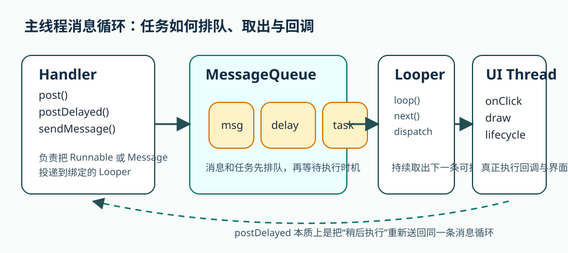

# Handler 与 Looper

很多现代 Android 项目已经大量使用协程，结果不少读者会误以为 `Handler` 和 `Looper` 已经变成纯历史知识。真正写项目时，这种判断常常会让人看不懂旧代码，也看不懂 Android 主线程到底为什么能持续处理输入、绘制和回调。`Handler`、`Looper` 这一章真正的价值，不是鼓励你回到旧式异步写法，而是让你建立对 Android 消息循环模型的直觉。

只要这个模型没理解透，很多现象都会像黑盒: 为什么 `post {}` 能回到主线程，为什么 `delay` 最终仍然离不开消息调度，为什么某些回调总是“稍后执行”，为什么不当使用 `Handler` 容易导致延迟任务和内存泄漏问题。理解消息循环之后，这些现象都会变得顺理成章。

## 学习目标

- 理解主线程消息循环的基本工作方式。
- 理解 `Looper`、`MessageQueue`、`Handler` 各自承担什么角色。
- 理解为什么现代项目即使主要使用协程，也仍然值得理解消息模型。
- 能判断 `Handler` 适合什么场景，不适合什么场景。

## 前置知识

- 已理解主线程与耗时任务边界。
- 已接触过主线程回调、延迟执行或旧式异步代码。

## 正文

### 1. 先别把 Handler 当成“老 API”，先把它当成主线程的工作方式

Android 主线程之所以能不断处理点击、绘制、生命周期回调和各种系统消息，背后依赖的就是消息循环。可以先用最朴素的方式理解:

- `Looper` 负责不断从队列里取消息。
- `MessageQueue` 负责存放等待执行的消息和任务。
- `Handler` 负责把任务发进队列，或者把取出的任务交给对应逻辑处理。

也就是说，`Handler` / `Looper` 不是额外附加的并发工具，而是 Android 主线程工作方式的一部分。

### 2. 为什么主线程不是“一直顺序执行代码”那么简单

很多初学者把主线程想成一条普通执行线: 一个方法跑完，再跑下一个方法。真实情况更接近一个不断处理事件的循环系统。按钮点击、View 绘制、Activity 生命周期回调、延迟任务、本地消息，都在这条循环上排队等着被处理。

理解这一点以后，很多常见写法就会变得自然:

- `handler.post { ... }` 是把任务丢回某个消息队列。
- `postDelayed` 是告诉队列“晚一点再处理这件事”。
- 某些回调不立即执行，是因为它们本质上要先进入消息循环。

### 3. Handler 真正做的事是什么

`Handler` 可以先看成“和某个 Looper 绑定的消息入口”。它最常做两类事情:

- 向对应线程的消息队列投递任务。
- 处理该线程队列中属于自己的消息。

在主线程上，这通常意味着:

- 把某个结果切回主线程执行。
- 安排一个稍后执行的 UI 操作。
- 与旧式 API 或框架消息机制对接。

所以 Handler 本身不是“线程”，也不是“异步任务”，它更像“往某条消息循环上挂任务的接口”。

### 4. 为什么 Looper 和 MessageQueue 要一起理解

单独记住 `Looper` 或 `Handler` 的 API 没太大意义。真正要理解的是它们之间的关系。

如果没有 `MessageQueue`，就没有地方排队等待处理的任务。

如果没有 `Looper`，队列里的任务就没有持续消费机制。

如果没有 `Handler`，普通代码就很难和这套消息循环系统交互。

把三者放在一起看，主线程就不再神秘: 它只是一直在循环消费消息。

如果这层关系还是抽象，可以先把它想成一条稳定的“排队 -> 取出 -> 回调”流水线。只要 `Handler` 继续把任务送进队列，`Looper` 就会不断把到时的消息取出来，再交给主线程继续处理点击、绘制、生命周期和延迟动作。



图：Handler 与 Looper 的消息循环示意图。`Handler` 不是线程本身，而是往某条消息循环上投递任务的入口；`MessageQueue` 负责排队，`Looper` 负责持续取出下一条可执行消息，最终仍由绑定线程执行回调。

### 5. 为什么现代项目仍然需要这章

即使你现在主要使用协程，这一章仍然重要，原因有三点。

第一，Android 平台本身很多机制就是基于消息循环实现的。你不理解它，很多系统行为就只能死记硬背。

第二，存量项目和第三方库里仍然大量存在 `Handler` 写法。读不懂这类代码，维护成本会很高。

第三，协程和 `Dispatchers.Main` 并不是脱离消息循环独立存在的。很多“回到主线程”的行为，最终仍然要落在主线程调度机制之上。

### 6. 一个典型使用场景: 延迟 UI 反馈

假设搜索框在用户停止输入 300 毫秒后才触发一次轻量提示，最传统的写法可能是:

```kotlin
private val handler = Handler(Looper.getMainLooper())

fun scheduleHint() {
    handler.removeCallbacksAndMessages(null)
    handler.postDelayed({
        hintView.isVisible = true
    }, 300)
}
```

这段代码真正值得学习的，不是“怎么延迟 300 毫秒”，而是:

- 任务被投递到了主线程消息队列。
- 旧任务被主动取消，避免重复执行。
- 最终执行仍发生在主线程。

这说明 `Handler` 很适合表达“在线程消息循环内调度一个稍后执行的动作”。

《Head First Android Development》里有一个更经典、也更适合建立直觉的例子：秒表应用在 `StopwatchActivity` 里维护 `seconds` 和 `running` 两个状态，`runTimer()` 每次先刷新界面上的时间文本，再通过 `postDelayed()` 把同一个 `Runnable` 安排到 1000 毫秒后再次执行。这个案例的妙处在于，它没有引入复杂线程模型，却清楚展示了 Handler 的两个核心动作：把任务送回消息队列，以及让同一段逻辑按节奏重复调度。今天如果只是实现页面内计时，协程也常常更自然；但从理解消息循环的角度，这个秒表例子比“网络请求回主线程”更透明。

`The Android Developer's Cookbook` 里的 `BackgroundTimer` 又把同一类问题换了一种更“消息队列可见”的写法：页面一边记录按钮点击次数，一边用 `SystemClock.uptimeMillis()` 计算应用启动后的经过时间，再通过 `Handler.postDelayed(mUpdateTimeTask, 200)` 每 200 毫秒递归刷新一次文本；进入 `onPause()` 时用 `removeCallbacks()` 停掉，回到 `onResume()` 再恢复。这个老例子特别适合拿来说明两件事：一是 `Handler` 调度的本质就是不断把同一个任务重新塞回队列；二是只要任务会跨越前后台，就必须把取消和恢复放进生命周期。

### 7. Handler 最容易出问题的地方不是语法，而是生命周期

`Handler` 本身不复杂，复杂的是你把它和谁绑定、它持有谁、页面是否还活着。典型问题包括:

- 页面销毁后，延迟任务还在，回来又去访问已失效视图。
- 匿名内部类或 lambda 持有页面引用，导致延迟任务延长对象生命周期。
- 同类任务不断排队，最后批量补执行，造成混乱。

所以教材里不能只教 `postDelayed`，还必须讲清楚取消和生命周期。

还有一个很常见但不够显眼的误用，是把 `Handler` 当成跨层通信总线。页面、ViewModel、Repository 之间如果开始互相丢 `post {}` 或 message code 来维持流程，短期看似灵活，长期却会让数据关系和线程边界变得不可推理。`Handler` 更适合表达“这条消息循环上的调度动作”，而不是承担整个应用的异步架构。

除了主线程延迟动作，`Handler` 还有一个很典型的老场景：把一串串行后台任务绑定到同一个 `Looper` 上。这时常见的搭配是 `HandlerThread`：

```kotlin
class ThumbnailDecoder {
    private val workerThread = HandlerThread("thumbnail-decoder").apply { start() }
    private val workerHandler = Handler(workerThread.looper)
    private val mainHandler = Handler(Looper.getMainLooper())

    fun decode(path: String, onDone: (Bitmap) -> Unit) {
        workerHandler.post {
            val bitmap = BitmapFactory.decodeFile(path)
            mainHandler.post {
                onDone(bitmap)
            }
        }
    }

    fun shutdown() {
        workerThread.quitSafely()
    }
}
```

这个例子特别适合帮助读者建立第二层直觉：`Handler` 不只是在主线程上“晚一点做事”，它也可以绑定到专门的工作线程，把一类任务排队串行处理。与此同时，`quitSafely()` 又提醒我们，消息循环一旦被自己创建出来，就必须由自己负责结束，这和主线程 Looper 由系统托管形成了非常清楚的对比。

早期不少书都会直接展示“在线程里手动 `Looper.prepare()` / `Looper.loop()`”的写法，这样当然有助于理解消息循环原理，但工程上更稳妥的做法通常仍然是优先用 `HandlerThread`。原因很简单：线程和它的 `Looper` 生命周期被绑在了一起，你不必自己再处理“线程启动了但 Handler 还没准备好”的竞态窗口。Apress 那类性能和消息循环章节会特别提醒这一点，因为自己拼装 Looper 线程时，最容易先踩到的就是初始化时机问题，而不是 API 语法。

如果把“后台串行工作线程 + 消息协议”合在一起，可以写成下面这样：

```kotlin
private const val MSG_SYNC_ALBUM = 1
private const val KEY_ALBUM_ID = "album_id"

class AlbumSyncThread(
    private val repository: AlbumRepository,
    private val onFinished: (String) -> Unit
) : HandlerThread("album-sync") {

    private lateinit var workerHandler: Handler
    private val mainHandler = Handler(Looper.getMainLooper())

    override fun onLooperPrepared() {
        workerHandler = object : Handler(looper) {
            override fun handleMessage(msg: Message) {
                if (msg.what != MSG_SYNC_ALBUM) return

                val albumId = msg.data.getString(KEY_ALBUM_ID).orEmpty()
                repository.syncAlbum(albumId)

                mainHandler.post {
                    onFinished(albumId)
                }
            }
        }
    }

    fun enqueueSync(albumId: String) {
        check(::workerHandler.isInitialized) {
            "Call start() before enqueueSync()."
        }

        val message = workerHandler.obtainMessage(MSG_SYNC_ALBUM).apply {
            data = Bundle().apply {
                putString(KEY_ALBUM_ID, albumId)
            }
        }
        workerHandler.sendMessage(message)
    }
}
```

这个例子有两个很实用的教学点。第一，`what + Bundle` 把后台线程收到的工作描述成了一条明确的命令，而不是“随手丢一段 lambda 进去”。第二，`onLooperPrepared()` 让 `workerHandler` 的可用时机和线程初始化对齐，这就是 `HandlerThread` 相比手写 `Looper.prepare()` 更不容易出竞态问题的地方。换句话说，`HandlerThread` 不是比原理更高级，而是把“线程 + Looper + 初始化顺序”这组三件事替你收拢成了一个更稳的工程边界。

《Android Application Development Cookbook, 2nd Edition》里的 Camera2 recipes 还提供了一个很现实的 HandlerThread 场景：预览请求、拍照回调和 `ImageReader` 出图，本质上都只是“相机线程上的消息”。如果这些回调直接落到主线程，页面上稍微多一点图片保存或格式转换，就很容易把 UI 拖慢；而把它们绑到专门的 `HandlerThread` 上时，相机相关回调就会在自己的消息循环里串行推进。

```kotlin
class CameraCaptureDispatcher {
    private val cameraThread = HandlerThread("camera-picture").apply { start() }
    private val cameraHandler = Handler(cameraThread.looper)

    fun bind(reader: ImageReader, onImageReady: (Image) -> Unit) {
        reader.setOnImageAvailableListener({ imageReader ->
            val image = imageReader.acquireLatestImage() ?: return@setOnImageAvailableListener
            try {
                onImageReady(image)
            } finally {
                image.close()
            }
        }, cameraHandler)
    }

    fun shutdown() {
        cameraThread.quitSafely()
    }
}
```

这个例子和前面的 `AlbumSyncThread` 其实在讲同一件事：`HandlerThread` 很适合承接“同一类回调需要按顺序串行处理”的工作。它不是为了把所有事情都做成旧式消息系统，而是为了给某一类线程内事件建立稳定的执行通道。相机预览、图片写盘、蓝牙回调、串口监听，很多平台型接口都保留着这种风格，因为它们真正需要的是“有序的线程消息处理”，而不是页面层那种以状态为中心的异步组织。

### 8. `Runnable` 是简化入口，`Message` 更适合表达“协议”

如果只是“一段稍后执行的代码”，`post {}` 和 `postDelayed()` 的确最顺手。但当两端开始约定消息类型、携带数据、反复转发结果时，老式的 `Message` / `handleMessage()` 模型反而更清楚。这也是很多旧项目、Messenger 通信和 Apress 里的 Handler 示例，仍然坚持用 `Message.obtain()`、`what` 和 `Bundle` 的原因。

```kotlin
private const val MSG_SHOW_RESULT = 1
private const val MSG_RETRY = 2
private const val KEY_TEXT = "text"

class SearchUiHandler(
    private val render: (String) -> Unit,
    private val scheduleRetry: () -> Unit,
) : Handler(Looper.getMainLooper()) {

    override fun handleMessage(msg: Message) {
        when (msg.what) {
            MSG_SHOW_RESULT -> render(msg.data.getString(KEY_TEXT).orEmpty())
            MSG_RETRY -> scheduleRetry()
        }
    }
}

fun dispatchSearchResult(handler: Handler, text: String) {
    val message = handler.obtainMessage(MSG_SHOW_RESULT).apply {
        data = Bundle().apply {
            putString(KEY_TEXT, text)
        }
    }
    handler.sendMessageDelayed(message, 250)
}
```

这段代码最值得理解的地方有三层。第一，`obtainMessage()` 会从 Handler 一侧拿到一个已经绑定目标处理者的 `Message`，这比自己随手 new 一个对象更符合消息队列模型。第二，`what` 和 `Bundle` 让消息有了“协议”意味，接收方可以区分不同动作并读取不同负载。第三，只要这个 Handler 仍然绑定 `Looper.getMainLooper()`，那么 `handleMessage()` 依旧运行在主线程上，它并不会自动把耗时工作搬去后台。

这也是很多旧代码最容易被误读的地方：看到 `sendMessage()` 就以为已经“异步化”了。实际上，如果消息只是被投递回主线程，那它解决的只是调度顺序问题，不是耗时执行问题。真正的后台工作仍然必须在 worker thread、协程或其他后台机制里完成，Handler 只负责把结果或控制信号送回合适的消息循环。

Smyth 在远程绑定服务的 worked example 里还展示了 `Handler + Messenger` 的另一层价值：当消息不只是在一个线程里排队，而是要在组件之间来回收发时，最好把“服务端 Handler”“客户端 `replyTo`”“绑定和解绑边界”放在同一个最小链路里理解。下面这个版本把最容易漏掉的绑定前提也补齐了：

```kotlin
private const val MSG_SEND_STATUS = 1
private const val KEY_STATUS = "status"

class RemoteStatusService : Service() {
    private val incomingHandler = object : Handler(Looper.getMainLooper()) {
        override fun handleMessage(msg: Message) {
            if (msg.what != MSG_SEND_STATUS) return

            val reply = Message.obtain(null, MSG_SEND_STATUS).apply {
                data = Bundle().apply {
                    putString(
                        KEY_STATUS,
                        "synced:${msg.data.getString(KEY_STATUS).orEmpty()}"
                    )
                }
            }
            msg.replyTo?.send(reply)
        }
    }

    private val messenger = Messenger(incomingHandler)

    override fun onBind(intent: Intent): IBinder = messenger.binder
}

class RemoteStatusConnection(
    private val context: Context,
    private val onReply: (String) -> Unit
) : ServiceConnection {
    private var remoteMessenger: Messenger? = null

    private val replyMessenger = Messenger(
        object : Handler(Looper.getMainLooper()) {
            override fun handleMessage(msg: Message) {
                if (msg.what == MSG_SEND_STATUS) {
                    onReply(msg.data.getString(KEY_STATUS).orEmpty())
                }
            }
        }
    )

    override fun onServiceConnected(name: ComponentName, service: IBinder) {
        remoteMessenger = Messenger(service)
    }

    override fun onServiceDisconnected(name: ComponentName) {
        remoteMessenger = null
    }

    fun bind() {
        context.bindService(
            Intent(context, RemoteStatusService::class.java),
            this,
            Context.BIND_AUTO_CREATE
        )
    }

    fun unbind() {
        context.unbindService(this)
    }

    fun requestStatus(taskId: String) {
        val message = Message.obtain(null, MSG_SEND_STATUS).apply {
            data = Bundle().apply { putString(KEY_STATUS, taskId) }
            replyTo = replyMessenger
        }
        runCatching { remoteMessenger?.send(message) }
    }
}
```

这个版本更适合教材读者观察五个点。第一，`Messenger` 并没有抛弃 Handler，它只是把 `IBinder`、`Message` 和 `replyTo` 组合成了一条可跨组件传递的消息通道。第二，服务端仍然在自己的 `Handler` 里解释 `what` 和 `Bundle`，这说明“消息协议”这层抽象并没有变化。第三，客户端只有在 `bindService(...)` 成功后才真正拿到远端 `Messenger`，这样“消息格式”和“连接前提”才不会被混成一件事。第四，`unbindService(...)` 让这段逻辑的生命周期边界清楚可见，不会给读者留下“连上以后就永远放着不管”的错觉。第五，消息通信依旧不等于耗时工作已经被妥善分类，真正的重任务仍然应该在服务内部进一步交给后台执行单元，而不是直接塞进 `handleMessage()`。

### 9. 什么场景下不必优先选择 Handler

现代 Android 中，很多原本能用 `Handler` 的场景，现在更适合交给:

- 协程和 `delay`
- `Flow` 的节流、去抖
- `WorkManager`
- 平台或 Jetpack 已提供的生命周期感知机制

这并不是说 `Handler` 被淘汰了，而是说明你要先判断问题本质。如果问题是页面内延迟动作，`Handler` 可以很好用；如果问题已经涉及生命周期复杂协作、后台执行或流式操作，别硬把它扛成万能解。

### 10. 实践任务

起点条件:

- 已有一个包含延迟动作、主线程切换或旧式回调代码的页面。

步骤:

1. 找出项目中一个使用 `Handler` 或可以用 `Handler` 表达的场景。
2. 画出它对应的线程、队列和执行时机。
3. 检查它是否存在页面销毁后仍执行的问题。
4. 对比一下如果用协程或 Flow，问题本质有没有变化。
5. 为这段逻辑补上取消或清理策略。

预期结果:

- 读者会把 Handler 看成消息循环机制的一部分，而不是孤立 API。
- 读者应能更清楚地理解主线程“稍后执行”的本质。
- 你也会更容易判断什么时候不该再硬用 Handler。

自检方式:

- 读者应能解释 `Looper`、`MessageQueue`、`Handler` 三者的关系。
- 读者应能说明 `postDelayed` 背后真正发生了什么。
- 读者应能判断一段 `Handler` 代码是否缺少生命周期清理。

调试提示:

- 延迟任务总在页面退出后还回调，优先检查是否缺少取消。
- 代码只会写 `post`，却解释不清主线程为什么能收到它，说明消息模型还没立稳。
- 如果一个需求本质是后台可靠执行，就不要再往 Handler 上硬靠。

### 11. 常见误区

- 把 Handler 只当成过时 API。
- 只会用 `post`，但不理解消息循环。
- 用 Handler 扛复杂生命周期和后台执行需求。
- 忽视延迟任务的取消和清理。

## 小结

`Handler` 与 `Looper` 的价值，不在于让你回到旧式异步写法，而在于让你真正理解 Android 主线程是怎样被驱动起来的。只要消息循环模型清楚了，主线程调度、延迟执行和很多框架行为都会更容易理解，后面再学习协程和 Flow，也会更容易看清它们建立在什么基础之上。

## 参考资料

- 参考并改写自：Bill Phillips、Chris Stewart、Kristin Marsicano、Brian Gardner，《Android Programming: The Big Nerd Ranch Guide, 5th Edition》(2022)，第 12 章异步基础部分。
- 参考并改写自：Dawn Griffiths、David Griffiths，《Head First Android Development》，Stopwatch 与 `Handler.postDelayed()` 相关示例。
- 参考并改写自：James Steele、Nelson To，《The Android Developer's Cookbook》(2011)，`BackgroundTimer`、`Handler.postDelayed()` 与生命周期取消相关 recipes。
- 参考并改写自：Satya Komatineni、Dave MacLean，《Apress Pro Android 4》(2012)，`Message.obtain()`、`sendMessageDelayed()` 与 `handleMessage()` 协作相关章节。
- 参考并改写自：Onur Cinar，《Apress Pro Android Apps Performance Optimization》(2012)，`HandlerThread`、消息线程初始化顺序与竞态规避相关章节。
- 参考并改写自本地 PDF：《Android Application Development Cookbook, 2nd Edition》，Camera2、`ImageReader` 与后台 `HandlerThread` 回调相关 recipes。

- 参考并改写自：Neil Smyth，《Android Studio Flamingo Essentials: Java Edition》(2023)，remote bound service 中 `IncomingHandler`、`Messenger`、`replyTo` 与消息回传相关示例。
- Processes and threads overview: <https://developer.android.com/guide/components/processes-and-threads>
- Handler reference: <https://developer.android.com/reference/android/os/Handler>
- Looper reference: <https://developer.android.com/reference/android/os/Looper>


