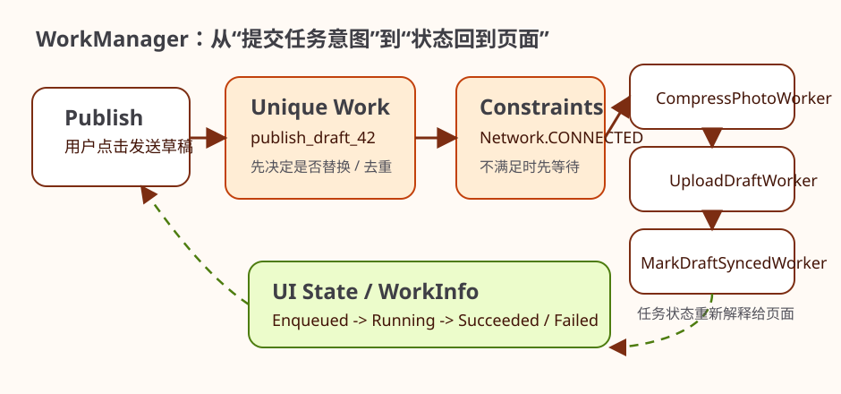

# WorkManager

很多读者第一次遇到 WorkManager，往往不是因为“想学一个 Jetpack 库”，而是因为手头有一类任务越来越难处理。比如用户在页面里写了一条草稿，点击发送后可以马上离开页面；比如应用需要定期同步一小批远程内容；比如日志和附件希望在合适网络下再上传。这些任务都很重要，但又不是用户眼前立刻就要看到的结果。如果你继续把它们塞在页面协程里，页面一结束任务就失去宿主；如果你为了它们启一个长期后台机制，又会很快踩到平台限制。

WorkManager 正是为这类问题准备的。它不是“后台万能工具”，也不是每个异步任务都该用的默认解。它更像一个任务调度系统：当任务可以延迟执行、需要系统帮你考虑时机、希望应用退出后仍尽量完成时，它就会变得非常合适。本章就从“怎样给任务分类”出发，再落到约束、重试、唯一任务和最小实现，而不是一上来就背 API。

## 学习目标

- 学会区分哪些任务适合 WorkManager，哪些不适合。
- 理解约束、重试、唯一任务和链式任务分别在解决什么实际问题。
- 理解 WorkManager 与页面协程、前台服务的边界。
- 用一个最小示例把延迟后台任务真正跑通。

## 前置知识

- 已理解后台任务不是所有异步工作的总称。
- 已知道不同任务类型应选择不同机制。

## 正文

### 1. 先做任务分类，而不是先选库

在 Android 里，后台相关问题最容易犯的错误，就是还没把任务看清楚，就先开始找工具。更稳妥的顺序通常反过来。你应该先问：这个任务是不是必须马上完成？用户现在是否正在等结果？任务是否需要持续展示给用户？应用退出后，它是否仍然有继续执行的价值？

如果任务属于“当前页面立刻要给用户结果”的那类，例如点一下按钮就要马上看到刷新结果、提交表单后必须立刻知道是否成功，那么它更像页面内异步动作，通常应该放在 `viewModelScope` 或其他页面生命周期内的并发链路里。  
如果任务属于“用户明确知道它正在持续进行，而且系统也必须允许它持续存在”的那类，例如导航、录音、持续定位、长时间媒体播放，那么它更接近前台服务。  
而 WorkManager 更适合第三类：任务重要，但不要求立刻完成；任务最好在系统觉得合适的时候运行；页面结束后它仍然值得继续；系统状态例如网络、电量、空闲条件会直接影响它是否适合执行。

只要先把这三类任务分开，WorkManager 的边界就会清楚很多。

### 2. 为什么草稿上传、内容同步这类任务特别适合 WorkManager

想象一个最小场景：用户在应用里写了一条待发送内容，点击发送后立刻切到别的页面。这个任务有几个很明显的特征。第一，它不是必须在 200 毫秒内给出可见结果；第二，它离开当前页面后仍然有价值；第三，它往往依赖网络条件；第四，失败后通常不是终局，而是应该择机重试。

这几乎就是 WorkManager 的理想场景。你不再需要让页面自己死死握住这个任务，也不需要自己在进程被系统回收后想办法恢复逻辑。WorkManager 更像是在帮你向系统提交一份“任务意图”：这项工作要做，但执行时机可以由系统结合约束和资源状态来安排。

Android 官方把它定义成适用于 deferrable, guaranteed background work 的工具。这句话如果翻成更工程化的理解，就是：它适合“可以延迟、但你又不想轻易丢掉”的工作。

### 3. WorkManager 真正提供的，不只是一个 `Worker`

很多人第一次使用 WorkManager，会把注意力全放在 `Worker` 这个类上，仿佛只要继承一个类、写一个 `doWork()` 就学会了。真正更重要的，是它背后的任务模型。你不是在“立刻开启一段后台代码”，而是在描述一项工作：它需要什么条件、失败后怎么办、同类工作是否允许重复、和其他工作有没有前后关系。

所以 WorkManager 的核心价值并不在“能执行代码”，而在“能把后台任务表达成系统可调度、可约束、可恢复、可观察的对象”。一旦你接受了这个思路，约束、唯一任务、链式任务、状态观察这些概念就都会显得非常自然，因为它们本来就在回答任务模型里的关键问题。

### 4. 约束、重试和唯一任务，分别在替你防什么坑

假设你要同步远程内容。如果设备当前没有网络，你当然不希望任务盲目启动然后立刻失败；如果用户在短时间内多次触发同一个同步动作，你也不希望一模一样的任务排满队列；如果服务器临时超时，你多半希望稍后再试，而不是直接宣判失败。这三个问题，恰好对应 WorkManager 里最值得认真设计的三件事。

约束在解决“什么时候做更合适”。网络、充电、存储空间、设备空闲状态，都会直接影响后台任务是否值得现在执行。  
重试在解决“失败是不是终局”。不是所有错误都该重试，但网络波动、超时和暂时性故障通常值得给第二次机会。  
唯一任务在解决“同类工作如何去重”。如果你对同一项同步任务每次都新建一份请求，最终很可能会得到重复执行、状态覆盖和资源浪费。

很多 WorkManager 用法看起来只是 API 选择，实际上背后都是工程判断。

再往前走一步，你还需要考虑任务是否具备幂等性和可恢复性。`Result.retry()` 只有在“重复执行不会破坏结果，且失败大概率是暂时性的”时才合理；如果一项工作一旦重复就可能造成重复扣费、重复发送或重复写入，那么在入队策略和业务侧保护上就必须更谨慎。WorkManager 帮你调度任务，但不会替你自动修正任务本身的业务语义。

如果把一条真实后台任务链摊开来看，WorkManager 其实不像“偷偷在后台跑一段代码”，更像“先提交一份任务意图，再等待系统在合适时机按顺序执行”。这也是为什么唯一任务、执行约束和状态观察最好一起理解，而不要把它们拆成互不相干的 API 片段。



图：WorkManager 任务流水线示意图。页面只负责提交任务意图，系统先根据唯一任务策略和约束条件决定是否执行，再按链式步骤推进，最后把 `WorkInfo` 状态重新折回页面。

### 5. 一个最小但真实的示例：同步待发送草稿

下面这个例子比“打印一句日志”更接近真实项目。我们假设应用里存在一个待发送草稿列表，用户离开当前页面后，系统应在有网络时尽量把这些草稿同步出去。

```kotlin
class SyncDraftWorker(
    appContext: Context,
    params: WorkerParameters
) : CoroutineWorker(appContext, params) {

    override suspend fun doWork(): Result {
        return try {
            draftRepository.syncPendingDrafts()
            Result.success()
        } catch (e: IOException) {
            Result.retry()
        } catch (e: Throwable) {
            Result.failure()
        }
    }
}

val constraints = Constraints.Builder()
    .setRequiredNetworkType(NetworkType.CONNECTED)
    .build()

val request = OneTimeWorkRequestBuilder<SyncDraftWorker>()
    .setConstraints(constraints)
    .build()

WorkManager.getInstance(context).enqueueUniqueWork(
    "sync_drafts",
    ExistingWorkPolicy.KEEP,
    request
)
```

这段代码可以放在后台任务相关文件中，例如 `SyncDraftWorker.kt` 和对应的任务触发处。真正要观察的不是它“能不能运行”，而是它表达出的任务判断：这项工作可以延迟；没有网络时不该执行；同类同步任务不应无限重复；遇到临时网络错误时应重试，而不是立刻失败。

如果你把这段逻辑放回页面里，页面一旦结束，任务生命周期就会和页面绑死。如果你把它做成长时间前台机制，又会和任务本身的延迟性质冲突。WorkManager 恰好位于这两者之间。

Big Nerd Ranch 的 `PhotoGallery` 例子还给出了一个很适合教学的渐进路径：先在 `PhotoGalleryFragment` 里用 `OneTimeWorkRequest.Builder(PollWorker::class.java)` 验证 `PollWorker` 会被触发，再补上 `Constraints.Builder().setRequiredNetworkType(NetworkType.UNMETERED)` 限制执行条件，最后改成 `PeriodicWorkRequestBuilder<PollWorker>(15, TimeUnit.MINUTES)` 并通过 `enqueueUniquePeriodicWork(POLL_WORK, ExistingPeriodicWorkPolicy.KEEP, periodicRequest)` 把轮询升级成可开关的唯一周期任务。这个例子最值得保留的，不是“定时查 Flickr”本身，而是它把 WorkManager 的三步判断拆得很清楚：先确认工作单元，再加执行约束，最后再讨论周期调度与去重策略。

### 6. 什么时候不要用 WorkManager

理解边界比会写示例更重要。最常见的误用，就是把所有“不在主线程”的工作都往 WorkManager 塞。下面几类任务通常不应优先考虑它。

第一类是用户当前就在等结果的操作。比如点击刷新后页面要立刻展示新内容，提交表单后要马上看到成功或失败。这类任务应该继续由页面状态层承接，而不是交给延迟调度系统。  
第二类是必须持续对用户可见的长任务，例如导航、运动追踪、录音、长时间播放。它们更接近前台服务。  
第三类是很轻量、页面结束后就完全失去价值的小动作，例如当前页里一次临时排序或一次本地格式转换。把这类工作交给 WorkManager 往往只会增加复杂度。

换句话说，WorkManager 的关键不是“能不能做”，而是“值不值得交给系统调度”。

### 7. 链式任务和可观察状态，什么时候开始变得重要

当任务不再只是“执行一个函数”时，WorkManager 的价值会进一步放大。比如上传图片之前要先压缩，拉取远程配置之前要先刷新 token，清理本地数据之前要先完成同步。这些都属于有顺序的后台工作流。你当然可以在某个协程里手写它们，但一旦任务脱离页面、进入系统调度时，链式表达会更稳定，也更容易维护。

同样，WorkManager 支持你观察任务状态，这一点对真实项目很有价值。页面不一定要实时盯着后台任务，但当用户主动回到某个界面时，你可能希望告诉他：同步还在排队、同步已经开始、同步刚刚失败、同步已经完成。后台任务之所以最终能被产品接受，不只因为它跑了，而是因为它的状态能被解释。

下面给一个更完整的链式任务例子，把“压缩图片 -> 上传草稿 -> 更新本地状态”写成同一条后台流水线。

```kotlin
class CompressPhotoWorker(
    appContext: Context,
    params: WorkerParameters,
    private val repository: DraftRepository
) : CoroutineWorker(appContext, params) {

    override suspend fun doWork(): Result {
        val draftId = inputData.getString(KEY_DRAFT_ID) ?: return Result.failure()
        repository.compressPendingImages(draftId)
        return Result.success()
    }
}

class UploadDraftWorker(
    appContext: Context,
    params: WorkerParameters,
    private val repository: DraftRepository
) : CoroutineWorker(appContext, params) {

    override suspend fun doWork(): Result {
        val draftId = inputData.getString(KEY_DRAFT_ID) ?: return Result.failure()
        return runCatching { repository.uploadDraft(draftId) }
            .fold(
                onSuccess = { Result.success() },
                onFailure = { Result.retry() }
            )
    }
}

class MarkDraftSyncedWorker(
    appContext: Context,
    params: WorkerParameters,
    private val repository: DraftRepository
) : CoroutineWorker(appContext, params) {

    override suspend fun doWork(): Result {
        val draftId = inputData.getString(KEY_DRAFT_ID) ?: return Result.failure()
        repository.markDraftAsSynced(draftId)
        return Result.success()
    }
}

fun enqueuePublishDraft(context: Context, draftId: String) {
    val compress = OneTimeWorkRequestBuilder<CompressPhotoWorker>()
        .setInputData(workDataOf(KEY_DRAFT_ID to draftId))
        .build()

    val upload = OneTimeWorkRequestBuilder<UploadDraftWorker>()
        .setInputData(workDataOf(KEY_DRAFT_ID to draftId))
        .setConstraints(
            Constraints.Builder()
                .setRequiredNetworkType(NetworkType.CONNECTED)
                .build()
        )
        .build()

    val markSynced = OneTimeWorkRequestBuilder<MarkDraftSyncedWorker>()
        .setInputData(workDataOf(KEY_DRAFT_ID to draftId))
        .build()

    WorkManager.getInstance(context)
        .beginUniqueWork(
            "publish_draft_$draftId",
            ExistingWorkPolicy.REPLACE,
            compress
        )
        .then(upload)
        .then(markSynced)
        .enqueue()
}
```

这类链式表达最适合处理“每个步骤都应该足够单纯，但整个流程要稳定串起来”的后台工作。压缩失败就不要进入上传；上传失败可以按网络错误重试；只有真正成功后才更新本地同步标记。把每一步拆开之后，出错位置、重试行为和后续维护都会清楚得多。

```kotlin
sealed interface PublishUiState {
    data object Idle : PublishUiState
    data object Enqueued : PublishUiState
    data object Running : PublishUiState
    data object Succeeded : PublishUiState
    data object Failed : PublishUiState
}

class PublishStatusViewModel(app: Application) : AndroidViewModel(app) {

    private val workManager = WorkManager.getInstance(app)

    fun observePublish(draftId: String): LiveData<PublishUiState> {
        return Transformations.map(
            workManager.getWorkInfosForUniqueWorkLiveData("publish_draft_$draftId")
        ) { infos ->
            when {
                infos.isEmpty() -> PublishUiState.Idle
                infos.any { it.state == WorkInfo.State.RUNNING } -> PublishUiState.Running
                infos.any { it.state == WorkInfo.State.FAILED } -> PublishUiState.Failed
                infos.all { it.state == WorkInfo.State.SUCCEEDED } -> PublishUiState.Succeeded
                else -> PublishUiState.Enqueued
            }
        }
    }
}
```

这里的状态观察同样重要。页面并不需要一直盯着后台流水线，但当用户重新回到发布页时，你可以把“正在排队”“正在上传”“刚刚失败”“已经完成”这些状态重新解释给他。WorkManager 真正适合生产环境的一点，不只是它能跑，而是它能把系统调度的结果重新折回页面状态层。

再往前走一步，你会发现 `beginUniqueWork()` 里的唯一名称其实也是建模的一部分。对“发布同一条草稿”这种需求来说，使用 `publish_draft_$draftId` 作为唯一键，表达的就是“同一个草稿只应该保留一条有效流水线”。这比事后排查重复上传要便宜得多。

如果 Worker 还需要真正接入生产环境，接下来最常见的两个问题通常是：“它怎么拿到 UseCase 或 Repository？”以及“失败和重试怎么写得更像业务规则，而不是默认兜底？”Socorro 的 `UploadMessagesWorker` 很适合回答前一个问题：不要在 `doWork()` 里自己 new 依赖，而是让 `HiltWorker` 或自定义 `WorkerFactory` 把依赖注入进来。Wangereka 的同步例子则补上了后一个问题：除了网络约束，电量条件、重试上限和输出结果都应该被明确建模，而不是全交给默认行为。

下面把这些工程化细节压成一个更接近真实项目的版本：

```kotlin
private const val KEY_ACCOUNT_ID = "account_id"
private const val KEY_UPLOADED_COUNT = "uploaded_count"
private const val KEY_ERROR_MESSAGE = "error_message"

@HiltWorker
class UploadMessagesWorker @AssistedInject constructor(
    @Assisted appContext: Context,
    @Assisted workerParams: WorkerParameters,
    private val uploadMessagesUseCase: UploadMessagesUseCase
) : CoroutineWorker(appContext, workerParams) {

    override suspend fun doWork(): Result {
        val accountId = inputData.getString(KEY_ACCOUNT_ID)
            ?: return Result.failure()

        return runCatching {
            uploadMessagesUseCase(accountId)
        }.fold(
            onSuccess = { uploadedCount ->
                Result.success(
                    workDataOf(KEY_UPLOADED_COUNT to uploadedCount)
                )
            },
            onFailure = { error ->
                if (error is IOException && runAttemptCount < 3) {
                    Result.retry()
                } else {
                    Result.failure(
                        workDataOf(
                            KEY_ERROR_MESSAGE to (error.message ?: "Upload failed")
                        )
                    )
                }
            }
        )
    }
}

fun enqueueWeeklyUpload(context: Context, accountId: String) {
    val constraints = Constraints.Builder()
        .setRequiredNetworkType(NetworkType.UNMETERED)
        .setRequiresBatteryNotLow(true)
        .build()

    val request = PeriodicWorkRequestBuilder<UploadMessagesWorker>(
        7,
        TimeUnit.DAYS
    )
        .setInputData(workDataOf(KEY_ACCOUNT_ID to accountId))
        .setConstraints(constraints)
        .setBackoffCriteria(
            BackoffPolicy.LINEAR,
            PeriodicWorkRequest.MIN_PERIODIC_INTERVAL_MILLIS,
            TimeUnit.MILLISECONDS
        )
        .build()

    WorkManager.getInstance(context).enqueueUniquePeriodicWork(
        "upload_messages_$accountId",
        ExistingPeriodicWorkPolicy.KEEP,
        request
    )
}
```

这段代码里有四个特别值得讲透的点。第一，`@HiltWorker` 让 Worker 像其他业务入口一样拿到 `UseCase`，这样真正的业务逻辑仍然停留在领域层，而不是散在调度层。第二，`runAttemptCount < 3` 表达了“网络暂时失败值得重试三次，但不能无限重试”这种明确业务判断。第三，`setBackoffCriteria(...)` 把“失败后多久再试”收成了调度策略，而不是靠应用自己睡眠等待。第四，`Result.success(workDataOf(...))` 和 `Result.failure(workDataOf(...))` 让任务输出重新变成下游可读取的数据，而不是只剩下一句日志。

如果团队用的不是 Hilt，而是 Koin 或自定义依赖注入，Wangereka 的例子还补上了一层很容易被漏掉的工程细节：不要一边想让 Worker 走自己的工厂，一边又保留 WorkManager 的默认初始化。否则系统会先按默认方式创建 WorkManager，你自己的 `WorkerFactory` 根本接不上去。

```kotlin
class ChapterEightApplication : Application(), Configuration.Provider {
    private val appContainer by lazy { AppContainer(this) }

    override val workManagerConfiguration: Configuration
        get() = Configuration.Builder()
            .setWorkerFactory(appContainer.workerFactory)
            .build()
}

class AppContainer(context: Context) {
    val workerFactory: WorkerFactory = AppWorkerFactory(
        syncWorkerFactory = SyncWorkerFactory(
            uploadMessagesUseCase = provideUploadMessagesUseCase(context)
        )
    )
}

class AppWorkerFactory(
    private val syncWorkerFactory: SyncWorkerFactory
) : WorkerFactory() {
    override fun createWorker(
        appContext: Context,
        workerClassName: String,
        workerParams: WorkerParameters
    ): ListenableWorker? {
        return when (workerClassName) {
            UploadMessagesWorker::class.java.name ->
                syncWorkerFactory.create(appContext, workerParams)
            else -> null
        }
    }
}
```

```xml
<provider
    android:name="androidx.startup.InitializationProvider"
    android:authorities="${applicationId}.androidx-startup"
    android:exported="false"
    tools:node="merge">
    <meta-data
        android:name="androidx.work.WorkManagerInitializer"
        android:value="androidx.startup"
        tools:node="remove" />
</provider>
```

这一组代码想讲清的是：`@HiltWorker` 只是“如何把依赖送进 Worker”的一种实现，背后真正的工程边界是“Worker 创建权到底交给谁”。如果你自己接管 `WorkerFactory`，就必须同时把 `Configuration.Provider`、一个真正可用的依赖入口，以及默认初始化器移除这三件事一起做完。这里故意把依赖来源放进 `AppContainer`，而不是试图让 `Application` 走构造函数注入，就是为了避免一个很常见的教学误解：`Application` 实例由框架创建，不能靠自定义构造函数接依赖。对大型项目来说，这一步非常关键，因为后台任务往往比页面入口更容易被忽略，而一旦工厂没接上，问题通常要到真机调度时才暴露。

如果页面需要把后台结果折回到 UI，也可以继续沿着 `WorkInfo` 读取输出数据：

```kotlin
class BackupStatusViewModel(app: Application) : AndroidViewModel(app) {
    private val workManager = WorkManager.getInstance(app)

    fun observeWeeklyUpload(accountId: String): LiveData<String?> {
        return Transformations.map(
            workManager.getWorkInfosForUniqueWorkLiveData("upload_messages_$accountId")
        ) { infos ->
            val failed = infos.firstOrNull { it.state == WorkInfo.State.FAILED }
            failed?.outputData?.getString(KEY_ERROR_MESSAGE)
        }
    }
}
```

这段观察代码说明了一件很重要的事：WorkManager 不是“后台做完就算了”，它仍然应该能把任务结果重新解释给前台。如果用户回到设置页、同步页或备份页时，你完全可以把“最近一次上传失败的原因”重新展示出来，而不是让后台任务变成一块不可见的黑箱。

如果任务本身持续时间比较长，另一个非常实用的能力是把“进行到哪一步了”折回前台。Socorro 在上传监听器和媒体进度更新里反复强调过，用户对后台工作的接受度很大程度上取决于它是否可解释。WorkManager 这里对应的能力就是 `setProgress(...)`：它不是最终结果，不会替代 `outputData`，但非常适合表达“正在进行中”的中间状态。

```kotlin
private const val KEY_PROGRESS = "progress"

class CompressMediaWorker(
    appContext: Context,
    params: WorkerParameters,
    private val repository: MediaRepository
) : CoroutineWorker(appContext, params) {

    override suspend fun doWork(): Result {
        val mediaIds = inputData.getStringArray(KEY_MEDIA_IDS)?.toList().orEmpty()
        if (mediaIds.isEmpty()) return Result.failure()

        mediaIds.forEachIndexed { index, mediaId ->
            ensureActive()
            repository.compress(mediaId)

            val progress = ((index + 1) * 100) / mediaIds.size
            setProgress(workDataOf(KEY_PROGRESS to progress))
        }

        return Result.success()
    }
}

class ExportProgressViewModel(app: Application) : AndroidViewModel(app) {
    private val workManager = WorkManager.getInstance(app)

    fun observeProgress(workId: UUID): LiveData<Int> {
        return Transformations.map(workManager.getWorkInfoByIdLiveData(workId)) { info ->
            info?.progress?.getInt(KEY_PROGRESS, 0) ?: 0
        }
    }
}
```

这段代码最值得区分的，是 `progress`、`outputData` 和最终 `state` 三者分别在表达什么。`progress` 只负责进行中的中间刻度，适合进度条、文案和弱提示；`outputData` 更适合最终成功/失败后需要被下一步或前台读取的结果；`WorkInfo.State` 则负责表达整个任务当前处于排队、运行、成功还是失败。把这三层混在一起时，页面常常会出现“明明已经失败了，但进度条还卡在 80%”这种很别扭的体验。

最后一个经常被忽略、但很影响工程信心的点，是 Worker 也应该能被测试。Wangereka 在 WorkManager 章节里专门演示了 `WorkManagerTestInitHelper`：先用 `SynchronousExecutor` 初始化测试版 WorkManager，再通过 `TestDriver` 主动满足约束条件。这样你测的不是“系统到底什么时候调度”，而是“当系统允许执行时，这个工作单元会不会按预期推进”。

```kotlin
@RunWith(AndroidJUnit4::class)
class UploadMessagesWorkerTest {

    @Before
    fun setUp() {
        val context = ApplicationProvider.getApplicationContext<Context>()
        val config = Configuration.Builder()
            .setExecutor(SynchronousExecutor())
            .build()

        WorkManagerTestInitHelper.initializeTestWorkManager(context, config)
    }

    @Test
    fun uploadRunsWhenConstraintsAreMet() {
        val context = ApplicationProvider.getApplicationContext<Context>()
        val request = OneTimeWorkRequestBuilder<UploadMessagesWorker>()
            .setConstraints(
                Constraints.Builder()
                    .setRequiredNetworkType(NetworkType.CONNECTED)
                    .build()
            )
            .build()

        val workManager = WorkManager.getInstance(context)
        workManager.enqueue(request).result.get()

        val testDriver = WorkManagerTestInitHelper.getTestDriver(context)!!
        testDriver.setAllConstraintsMet(request.id)

        val workInfo = workManager.getWorkInfoById(request.id).get()
        assertThat(workInfo.state).isEqualTo(WorkInfo.State.SUCCEEDED)
    }
}
```

这个测试样板非常值得保留，因为它把 WorkManager 的两个层次分开了。纯业务逻辑，例如“上传失败几次后该不该重试”，更适合继续在 UseCase 层做普通单元测试；而 Worker 测试更像是在验证“输入数据、约束条件、调度框架和结果状态”这一层是否连通。只要这两层分开，后台任务就不会再像一块既难测、又只能靠真机碰运气验证的黑箱。

### 8. 实践任务

起点条件：

- 已有一个可延迟执行的需求，例如同步、上传、清理、整理或定期刷新。
- 这个需求在页面关闭后仍然有继续执行的价值。

步骤：

1. 先写一句话定义你的任务目标，例如“有网络时把待发送草稿同步到服务器”。
2. 判断这个任务为什么不该放在页面协程里，也为什么不必升级成前台服务。
3. 为它选择一个最小约束条件，例如联网才执行。
4. 判断失败后应该 `retry` 还是 `failure`，并解释原因。
5. 再判断同类任务是否应该唯一存在，还是允许并发或排队。
6. 把任务真正实现为一个 `Worker`，然后在触发点入队一次工作请求。

预期结果：

- 读者应能明确说出这个任务为什么适合 WorkManager。
- 读者会开始从任务模型角度思考约束、重试和唯一策略。
- 你不再把 WorkManager 当成“后台万能答案”。

自检方式：

- 读者应能解释：为什么这个任务可以接受延迟执行。
- 读者应能解释：为什么它离开当前页面后仍然有继续执行的价值。
- 读者应能说明：为什么你选择了当前的约束、重试和唯一任务策略。

调试提示：

- 如果用户当前正在等待结果，先重新审视任务分类，很多时候它根本不该进 WorkManager。
- 如果你发现相同任务被频繁重复执行，优先检查唯一任务策略是否缺失。
- 如果任务对网络、电量或设备状态敏感，却没有任何约束条件，后续表现通常会非常不稳定。

### 9. 常见误区

- 把 WorkManager 当成所有后台工作的默认答案。
- 先写 `Worker`，再勉强给任务找适用场景。
- 完全不设计约束、重试和唯一策略。
- 把用户当前正在等待的即时操作也交给 WorkManager。

## 小结

WorkManager 最重要的不是 API，而是任务分类。只要你先看清一项工作是否真的可以延迟、是否值得离开页面后继续、是否需要系统帮你决定执行时机，WorkManager 就会显得非常自然。它解决的不是“如何把代码丢到后台”，而是“如何把值得完成的延迟任务组织成稳定系统”。接下来再回看通知、服务和数据同步，你会更容易判断它们和 WorkManager 分别应该站在什么位置。

## 参考资料

- 参考并改写自本地 PDF：Bill Phillips、Chris Stewart、Kristin Marsicano、Brian Gardner，《Android Programming, 5th Edition - The Big Nerd Ranch Guide》(2022)，第 22 章中 `PollWorker`、`Constraints.Builder()`、`PeriodicWorkRequestBuilder` 与 `enqueueUniquePeriodicWork()` 的完整教学示例。
- 参考并改写自：Guilherme Socorro，《Thriving in Android Development Using Kotlin》(2024)，`UploadMessagesWorker`、`@HiltWorker`、`runAttemptCount` 与周期任务重试策略相关章节。
- 参考并改写自：Humphrey Wangereka，《Mastering Kotlin for Android 14》(2024)，`CoroutineWorker`、电量/网络约束、唯一任务配置、自定义 `WorkerFactory` 与默认初始化移除相关章节。

- WorkManager overview：<https://developer.android.com/topic/libraries/architecture/workmanager>
- Define work requests：<https://developer.android.com/develop/background-work/background-tasks/persistent/getting-started/define-work>
- Manage work：<https://developer.android.com/develop/background-work/background-tasks/persistent/how-to/manage-work>
- Now in Android：<https://github.com/android/nowinandroid>

