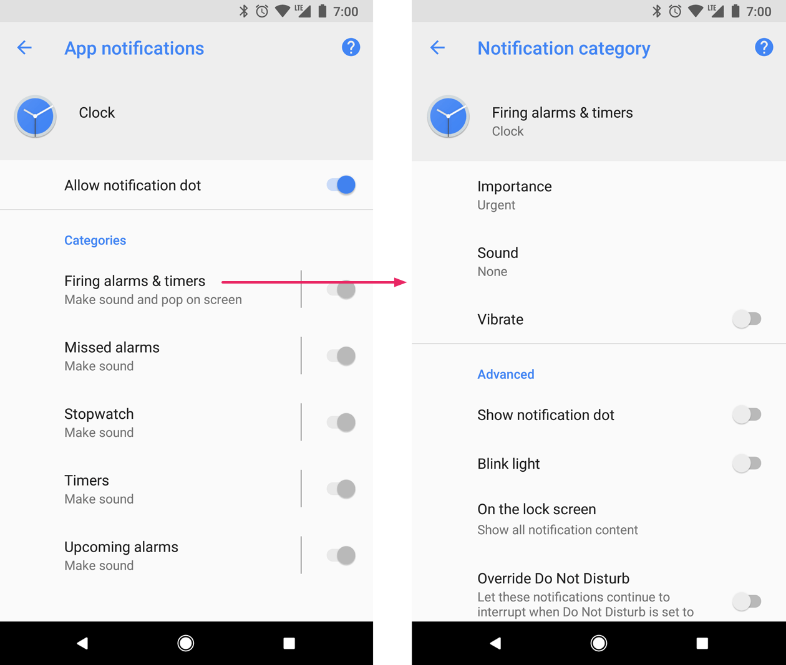
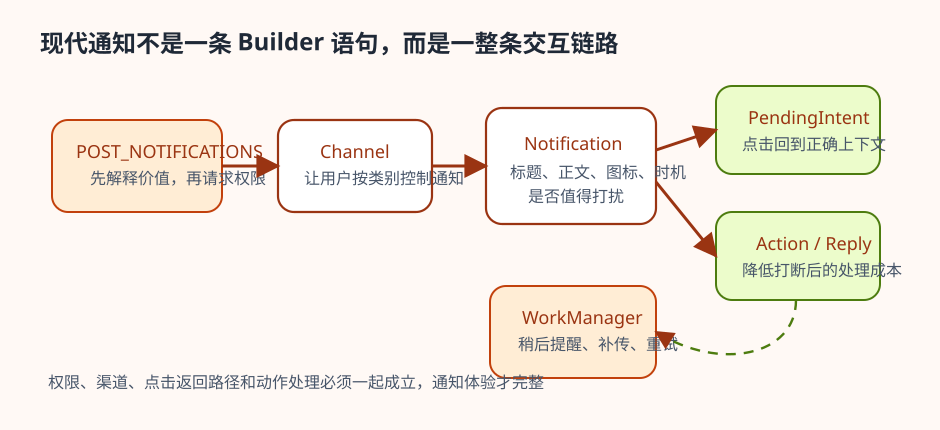
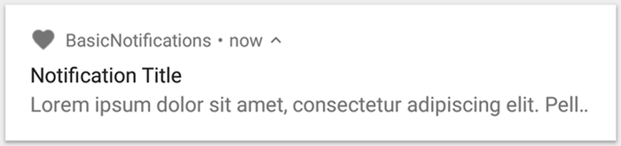

# Notification

很多开发者第一次学通知，会把它理解成“从后台弹一条消息”的技巧。这样理解虽然能让第一条通知显示出来，却很难支撑后续判断：什么时候值得打扰用户，为什么通知一定要分渠道，为什么 Android 13 以后不能再默认把通知当成永远畅通的出口，为什么前台服务必须挂通知，为什么一条通知发得出来并不等于它设计得合理。本章真正要建立的，不是一个 `Builder` 的写法记忆，而是一套系统级沟通能力的判断框架。

今天写通知，必须同时考虑用户打扰成本、系统权限、渠道治理和回到正确上下文的路径设计。换句话说，通知不是单一 API 主题，而是一条从渠道、权限、内容到后续操作路径都要成立的系统级交互链路。

## 学习目标

- 理解通知的价值是系统级用户沟通，而不是技术弹窗。
- 理解本地通知与远端通知最终都落在同一套系统表面和用户控制模型上。
- 理解通知渠道、通知权限、PendingIntent 和动作按钮各自解决什么问题。
- 学会判断什么时候该发通知，什么时候不该发，以及发出后应把用户带回哪里。

## 前置知识

- 已理解后台任务、前台服务、Intent、PendingIntent 和系统组件边界。
- 已接触提醒、消息、上传、下载或播放类场景。
- 最好已经了解 Android 13 之后的运行时权限基本概念。

## 正文

### 1. 通知是系统级沟通通道，不是后台日志输出口

通知的出现位置决定了它的性质。它不在应用内部页面里，而是在状态栏、通知抽屉、桌面图标角标、长按图标菜单等系统表面上出现。这意味着只要应用发出通知，事情就已经不再只是“内部状态变化”，而是在请求用户注意力。

通知通常可以分为本地通知和远端通知：前者由设备上的应用自己触发，后者由远端服务送达。但不管来源是什么，它们最终都进入同一套系统表面，也都受到同一套用户控制规则约束。这个区分的价值不在于记住术语，而在于帮助读者意识到：通知不是某个业务模块的私有 UI，而是系统级沟通能力，所以必须同时满足系统约束和用户预期。

### 2. 第一判断不是“能不能发”，而是“值不值得打扰”

通知最容易写坏的地方，不是 API，而是价值判断。到期提醒通常值得通知，因为用户本来就在等这个时刻；聊天新消息通常值得通知，因为它天然具有时效性；文件上传完成也常常值得通知，因为用户需要知道后续可以做什么。相反，缓存刷新、埋点上报、后台预热、任务开始执行这类内部状态，往往并不值得打断用户。

因此，一条通知在动手实现之前，至少要先回答两个问题：用户为什么现在必须知道这件事，以及如果现在不通知，会不会真的损害用户目标。只要这两个问题说不清，通知大概率就不该发。通知设计的成熟度，往往不是体现在花哨样式上，而是体现在应用是否克制地使用打扰权。

### 3. 渠道不是配置项，而是用户控制权的边界

通知渠道的意义值得单独强调。Android 8.0 及以上要求通知必须归属到渠道，不是为了增加配置步骤，而是为了让用户按类别管理通知。用户不该只能在“全开”和“全关”之间做选择，而应该知道自己关掉的是消息提醒、任务提醒、下载进度还是后台更新。

这带来两个直接设计要求。第一，渠道要少而有意义。渠道没有必要无限细分，过多渠道只会让用户困惑。第二，渠道名称和描述必须站在用户视角，而不是内部实现视角。像“消息提醒”“待办到期提醒”“下载进度”这样的命名是用户能理解的；像“后台同步”“Push 事件分发”“消息模块 2 号通道”这样的命名则几乎只对开发者自己有意义。

用户最终能感知到的，往往正是系统设置里的这层渠道界面，而不是你的内部模块命名。也就是说，渠道设计做得好不好，会直接体现在用户能不能看懂并控制这些开关。



图：系统设置中的通知渠道管理界面示意。用户看到的是可理解的通知类别，以及每个渠道各自独立的控制开关。

官方文档也确认了这条边界：从 Android 8.0 开始，如果目标版本是 API 26 或更高，通知没有指定渠道就不会正常显示。换句话说，渠道不是可选优化，而是当前通知设计的主线入口。

### 4. Android 13 之后，通知权限改变了默认前提

如果说通知渠道改变的是“用户怎么管通知”，那么 Android 13 的 `POST_NOTIFICATIONS` 运行时权限改变的就是“应用还能不能默认把通知发出去”。官方文档当前明确说明：对安装在 Android 13 及以上设备上的应用，通知默认是关闭的；目标版本为 Android 13 或更高时，应用可以自行决定在什么时机请求权限。

这意味着通知权限请求不能再像旧教程里那样，只在代码流程里机械地补一句。更合理的策略，是在用户已经看得见价值的时刻再解释为什么需要通知。例如，用户刚创建提醒任务时再申请提醒权限，远比第一次启动就弹权限框更容易被理解。通知权限的变化，本质上是在提醒开发者：通知机会是稀缺资源，只有和真实价值绑定时，用户才更愿意把它交给你。

Neil Smyth 在 `Android Studio Narwhal Essentials` 里把这条现代通知链路拆得很清楚：先创建通知渠道，再请求 `POST_NOTIFICATIONS`，随后用 `PendingIntent` 把通知点击动作接回 `ResultActivity`，再在下一章继续扩展到 Direct Reply。这个教学顺序值得保留，因为它提醒我们：现代通知不是单靠一段 `Builder` 代码就算完成，而是要把权限、渠道、入口和后续操作一起设计。

如果把这条链路放成一张图，通知设计会比“先记住哪个 API”更容易建立判断框架。通知真正完整的形态，往往是从权限时机、渠道分类，一路延伸到点击返回路径和动作处理方式，而不是孤立的一条消息文本。



图：现代通知链路图。权限、渠道、通知内容、点击返回路径和动作按钮是同一条系统级沟通链路的不同环节，只要其中一层缺失，通知体验就很容易变形。

### 5. 一条通知至少要说清楚“发生了什么、为什么值得看、点进去到哪里”

一条可用通知至少要包含几个最小元素：状态栏图标、抽屉中的可读内容、用户点击后的 `PendingIntent`，以及所属渠道。这个组合背后的设计意义非常清楚：通知不仅要让用户知道发生了什么，还要让用户知道点进去会回到哪一层上下文。

从系统表面看，最基础的通知通常就是“小图标 + 标题 + 正文”的组合。用户先看到的是这个外壳，之后才会决定是否点进去或展开查看更多操作。



图：基础通知的外观示意。真正影响理解的是内容是否明确，以及它能否把用户带回正确的任务上下文。

下面这个最小示例演示的是一条“消息提醒”通知的骨架。代码本身不复杂，但它把通知设计里几个最重要的点放在了一起：渠道、内容、点击后的返回路径。

```kotlin
private const val CHANNEL_MESSAGES = "messages"

fun ensureMessageChannel(context: Context) {
    if (Build.VERSION.SDK_INT >= Build.VERSION_CODES.O) {
        val channel = NotificationChannel(
            CHANNEL_MESSAGES,
            "消息提醒",
            NotificationManager.IMPORTANCE_DEFAULT
        ).apply {
            description = "聊天与站内消息提醒"
        }

        context.getSystemService(NotificationManager::class.java)
            .createNotificationChannel(channel)
    }
}

fun buildMessageNotification(
    context: Context,
    contentIntent: PendingIntent
): Notification {
    return NotificationCompat.Builder(context, CHANNEL_MESSAGES)
        .setSmallIcon(R.drawable.ic_notification)
        .setContentTitle("你有 3 条新消息")
        .setContentText("点击继续查看会话")
        .setContentIntent(contentIntent)
        .setAutoCancel(true)
        .build()
}
```

这段代码真正要传达的不是“NotificationCompat.Builder 的参数顺序”，而是通知必须把用户带回正确位置。如果通知只能把用户带回一个模糊首页，那么就算它技术上发成功了，体验也仍然是不完整的。通知从来都是跨组件入口，所以它天然和 Intent、PendingIntent、导航栈设计绑在一起。

### 6. 动作按钮和 Direct Reply 的意义，是降低打断后的操作成本

`Head First Android Development` 里 `DelayedMessageService` 的例子，正好能把这条通知链路讲得非常具体：`MainActivity` 先启动 service，service 等 10 秒后构建通知，再借助 `TaskStackBuilder` 和 `PendingIntent` 把用户点通知后的返回路径重新接回 `MainActivity`。这个案例的教学价值很高，因为它说明通知真正完整的设计并不是“把内容发出去”就结束了，而是要同时考虑消息何时出现、由谁发出、点进去以后如何回到正确任务栈。把通知理解成这条完整链路，后面再看渠道、权限和动作按钮，逻辑就会顺很多。

动作按钮和 Direct Reply 的价值，不在于让通知看起来更丰富，而在于让用户在尽量短的路径里处理这件事。消息通知可以直接回复，音乐通知可以暂停或下一首，待办提醒可以标记完成或稍后提醒，这些都在降低通知带来的打断成本。

所以动作按钮不该被当成装饰功能，而应该被看作用户处理成本优化的一部分。如果一条通知每次都强迫用户先进应用、再打开页面、再找到目标内容，它就很容易从帮助变成骚扰。通知越强势，处理路径就越应该短。

`Android Application Development Cookbook, 2nd Edition` 里有个名字很直白的例子叫 `Lights, Action, and Sound Redux using Notifications`。它把声音、灯光、震动和 `addAction()` 按钮都塞进同一条通知里，同时又明确提醒“不是因为能加就都该加”，并强调按钮背后的 `PendingIntent` 最好把用户带回具体项目而不是模糊首页。这个例子虽然写于渠道普及之前，但它留下的设计判断今天仍然成立：通知能力越强，越要克制；动作按钮越多，越要精确。

同一本 Narwhal Essentials 在 Direct Reply 教程里继续把这层设计推进了一步：它不是停在“加个按钮”，而是用 `RemoteInput` 把用户在通知面板里输入的文本直接随 `PendingIntent` 带回 Activity。这个案例特别适合帮助读者建立一个现代直觉：Direct Reply 不是“让通知更花哨”，而是在不强迫用户完整跳回应用的前提下，把处理路径再缩短一步。

### 7. 通知和前台服务、后台任务是连在一起的

很多教程会把通知当成一个独立主题来讲，但实际工程里它几乎总是和提醒、消息、前台服务、后台任务、深链接恢复一起出现。尤其是前台服务，更能说明通知为什么不是附属物。只要应用想在页面之外持续执行一项用户可感知的重要任务，系统就要求它通过通知把这件事显式告诉用户。

这意味着通知不只是“有消息时弹一下”，它还是系统可见性和用户知情权的一部分。也正因为如此，前台服务通知、长期进行中的下载通知、媒体播放通知，和普通信息提醒在设计上不能混为一谈。它们的渠道、重要性、操作按钮和持续展示方式，都应由任务性质决定，而不是统一套一层模板。

### 8. 一个更现实的判断例子：待办提醒值得通知，缓存刷新通常不值得

把两个场景并排放在一起，通知判断就会清楚很多。待办提醒是用户主动设置的时间点，到了时间之后，通知本身就是功能的一部分，用户也期待被提醒。缓存刷新则完全不同。它是应用内部为了后续体验更顺而做的准备工作，对用户来说通常不可见，也不会改变当前任务目标。

这两个场景最大的区别，不在于技术复杂度，而在于用户是否在等待这个信息。通知该不该发，很多时候就是这样判断出来的：如果用户正在等，它很可能值得通知；如果只是系统内部流程走到某一步了，它大概率不该打断用户。

如果把权限申请、点击路径和动作按钮放进同一条代码链里，通知设计会比单看 `Builder` 清楚得多。

```kotlin
class ReminderActivity : ComponentActivity() {

    private val requestNotificationsPermission = registerForActivityResult(
        ActivityResultContracts.RequestPermission()
    ) { granted ->
        if (granted) {
            publishReminder("task-42", "提交周报")
        } else {
            reminderViewModel.onNotificationsPermissionDenied()
        }
    }

    fun onEnableReminderClicked(taskId: String, title: String) {
        if (
            Build.VERSION.SDK_INT < Build.VERSION_CODES.TIRAMISU ||
            ContextCompat.checkSelfPermission(
                this,
                Manifest.permission.POST_NOTIFICATIONS,
            ) == PackageManager.PERMISSION_GRANTED
        ) {
            publishReminder(taskId, title)
        } else {
            requestNotificationsPermission.launch(Manifest.permission.POST_NOTIFICATIONS)
        }
    }

    private fun publishReminder(taskId: String, title: String) {
        ReminderNotifier(this).showTaskDue(taskId, title)
    }
}

class ReminderNotifier(private val context: Context) {

    fun showTaskDue(taskId: String, title: String) {
        ensureReminderChannel(context)

        val contentIntent = TaskStackBuilder.create(context)
            .addNextIntentWithParentStack(TaskDetailActivity.newIntent(context, taskId))
            .getPendingIntent(
                taskId.hashCode(),
                PendingIntent.FLAG_UPDATE_CURRENT or PendingIntent.FLAG_IMMUTABLE,
            )

        val snoozeIntent = Intent(context, SnoozeReminderReceiver::class.java).apply {
            action = ACTION_SNOOZE_REMINDER
            putExtra(EXTRA_TASK_ID, taskId)
        }
        val snoozePendingIntent = PendingIntent.getBroadcast(
            context,
            taskId.hashCode(),
            snoozeIntent,
            PendingIntent.FLAG_UPDATE_CURRENT or PendingIntent.FLAG_IMMUTABLE,
        )

        val notification = NotificationCompat.Builder(context, CHANNEL_REMINDERS)
            .setSmallIcon(R.drawable.ic_notification)
            .setContentTitle("待办即将到期")
            .setContentText(title)
            .setContentIntent(contentIntent)
            .setAutoCancel(true)
            .addAction(R.drawable.ic_snooze, "10 分钟后提醒", snoozePendingIntent)
            .build()

        NotificationManagerCompat.from(context)
            .notify(taskId.hashCode(), notification)
    }
}

class SnoozeReminderReceiver : BroadcastReceiver() {

    override fun onReceive(context: Context, intent: Intent) {
        if (intent.action != ACTION_SNOOZE_REMINDER) return
        val taskId = intent.getStringExtra(EXTRA_TASK_ID) ?: return

        val request = OneTimeWorkRequestBuilder<RescheduleReminderWorker>()
            .setInitialDelay(10, TimeUnit.MINUTES)
            .setInputData(workDataOf(EXTRA_TASK_ID to taskId))
            .build()

        WorkManager.getInstance(context).enqueueUniqueWork(
            "snooze-reminder-$taskId",
            ExistingWorkPolicy.REPLACE,
            request,
        )
    }
}
```

这条链路里每一层都对应着通知设计里的一个真实判断。`ReminderActivity` 负责在用户已经看见价值的时刻请求 `POST_NOTIFICATIONS`，而不是在冷启动第一秒就机械弹框；`ReminderNotifier` 负责把通知内容、渠道和点击返回路径组织完整；`SnoozeReminderReceiver` 则把动作按钮收到的事件快速转交给后台调度层，而不是在广播入口里自己做长任务。

如果场景是消息而不是待办，还可以把 Direct Reply 再往前推进一步。它的意义不是“让通知更花哨”，而是让用户在最短路径里处理这件事。

```kotlin
class ReplyMessageReceiver : BroadcastReceiver() {

    override fun onReceive(context: Context, intent: Intent) {
        val replyText = RemoteInput.getResultsFromIntent(intent)
            ?.getCharSequence(KEY_REPLY_TEXT)
            ?.toString()
            ?.takeIf { it.isNotBlank() }
            ?: return

        val conversationId = intent.getStringExtra(EXTRA_CONVERSATION_ID) ?: return
        messageRepository.sendQuickReply(conversationId, replyText)
    }
}
```

这里最重要的教学点并不是 `RemoteInput` 的语法，而是通知动作也应该继续遵守同一套边界: 入口短、动作明确、结果回到正确上下文、必要时交给更稳定的执行层。只要把权限、渠道、返回路径和动作转交一起设计，通知就不会再退化成“系统层弹一条字”。

### 9. 实践任务

起点条件：

- 已有一个提醒、消息、播放、上传下载或后台任务场景。

步骤：

1. 选择一类你准备通过通知告知用户的事件。
2. 用一句话写清它为什么值得现在打扰用户。
3. 为它设计一个单独且可理解的通知渠道，而不是复用“大杂烩渠道”。
4. 设计用户点击通知后应恢复到的具体页面上下文。
5. 如果用户不必进应用就能处理，判断是否需要动作按钮或 Direct Reply。
6. 如果面向 Android 13 及以上设备，补充通知权限请求的最佳时机说明。

预期结果：

- 读者会先从价值和上下文判断通知，而不是先写 Builder。
- 通知渠道、权限申请时机和点击路径会更清楚。
- 读者应能更自然地把通知和后台任务、前台服务、导航联系起来。

自检方式：

- 读者应能解释为什么通知不是简单的后台输出。
- 读者应能判断某类事件是否真的值得打扰用户。
- 读者应能说明为什么渠道设计其实是在设计用户控制权。
- 读者应能解释 Android 13 以后通知权限为什么改变了默认设计前提。

调试提示：

- 如果你说不清用户为什么必须现在知道这件事，先别发通知。
- 如果所有通知都塞进一个渠道，说明用户控制模型还没有建立。
- 如果点击通知只能回到模糊首页，说明通知入口设计仍然不完整。
- 如果权限请求总在用户还看不到价值时弹出，授权通过率通常不会高。

### 10. 常见误区

- 把通知当成后台日志输出口。
- 不分渠道，把所有通知混成一类。
- 只关心“发得出来”，不关心用户是否真的需要。
- 忽略点击路径和上下文恢复。
- 在 Android 13 及以上仍然假设通知默认可用。
- 把前台服务通知和普通提醒混成同一种产品语义。

## 小结

Notification 真正的价值，是在系统层和用户层之间建立一条正式沟通通道。它既可能是提醒，也可能是前台服务的可见性载体，还可能是用户返回任务上下文的入口。只要从“是否值得打扰用户”出发，再把渠道、权限、内容、入口和操作成本一起设计，通知就会从技术功能变成真正可用、可维护的产品能力。

## 参考资料

- 参考并整理自本地 EPUB：Bryan Sills、Brian Gardner、Kristin Marsicano、Chris Stewart，《Android Programming: The Big Nerd Ranch Guide, 5th Edition》，通知渠道、PendingIntent 与通知类别设计相关内容。
- 参考并整理自本地 EPUB：Dawn Griffiths、David Griffiths，《Head First Android Development》，`DelayedMessageService`、`TaskStackBuilder` 与通知返回路径相关示例。
- 参考并整理自本地 PDF：Neil Smyth，《Android Studio Narwhal Essentials: Java Edition》(2025)，第 58-59 章，涵盖通知概览、渠道、`POST_NOTIFICATIONS`、动作按钮与 Direct Reply。
- 参考并整理自本地 PDF：Rick Boyer、Kyle Mew，《Android Application Development Cookbook, 2nd Edition》(2016)，通知构建、动作按钮与 `PendingIntent` 相关 recipes。
- Notification runtime permission: <https://developer.android.com/develop/ui/views/notifications/notification-permission>
- Create and manage notification channels: <https://developer.android.com/develop/ui/views/notifications/channels>
- Create a notification: <https://developer.android.com/develop/ui/views/notifications/build-notification>
