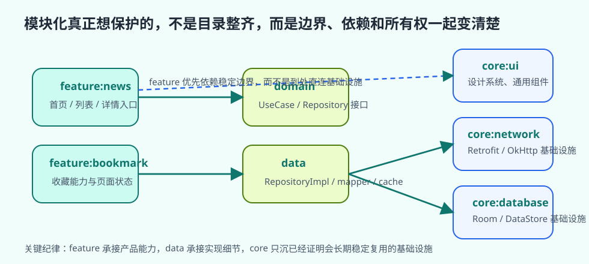

# 模块化开发

很多团队第一次认真讨论模块化，往往不是因为“想让工程看起来更高级”，而是因为单体工程已经开始持续制造成本。改一个页面要等很久才能重新构建，一个共享依赖的变化会把很多无关模块都卷进来，多个开发者长期在同一个 `app` 模块里互相踩改动，最后连“这段代码到底该放哪”都越来越难回答。到了这个阶段，问题就不再是目录整不整齐，而是工程结构已经撑不住长期协作了。

因此，模块化最该被理解成一次边界治理，而不是一次目录整理。它试图同时回答三件事：功能边界怎样收拢，依赖方向怎样变清楚，构建和协作怎样不再被同一个巨型模块拖住。只有把这三件事放在一起看，模块化才会从“工程名词”变成真正有价值的实践。

## 学习目标

- 理解模块化真正解决的是边界和协作问题，而不是目录美化问题。
- 理解 feature、data、core 等常见模块划分背后的逻辑。
- 理解模块化与构建速度、依赖治理、团队协作之间的关系。
- 学会判断什么时候值得开始模块化，什么时候不必过度拆分。

## 前置知识

- 已理解 Gradle、构建变体和基础分层。
- 已接触 ViewModel、Repository、UseCase 等职责边界。

## 正文

### 1. 单体工程为什么会越来越难维护

项目刚开始时，把所有内容都放进 `app` 模块并不奇怪。页面少、依赖少、团队也小，这样做的认知成本最低。但随着首页、搜索、详情、收藏、设置、离线缓存、埋点、上传、调试工具等能力不断加入，`app` 模块就会慢慢承担几乎一切职责。功能代码在这里，共享 UI 在这里，网络和数据库也在这里，调试和发布配置也在这里。短期看起来很方便，长期则会持续放大几个问题：依赖会向整个项目扩散，改动影响面越来越难估计，编译范围越来越大，协作时也越来越难判断谁应该拥有哪段代码。

单体工程真正让团队疲惫的，从来不是“类太多”这么简单，而是结构失去了表达能力。代码仍然能跑，但工程已经无法清楚表达产品边界、依赖边界和所有权边界。模块化的价值，正是在这里开始出现。

### 2. 模块化首先解决的是边界，而不是规模

很多人把模块化和“大项目”直接画等号，这样理解太窄了。更准确的判断标准，其实不是代码量，而是边界是否已经混乱。只要你开始频繁遇到这些现象：功能代码和共享代码混在一起，一个小改动总会波及很多无关区域，新成员很难判断代码该放在哪，多个页面反复复制相近实现，那么模块化就已经值得被认真考虑。

这也是为什么模块化不该被理解成“项目够大了就自然要拆”。真正推动模块化的，是工程边界已经失真。换句话说，模块化首先是在恢复表达能力，让项目重新能回答“这块能力属于谁”“它能依赖谁”“别人应通过什么接口使用它”这类基本问题。

### 3. 为什么 feature、data、core 这类划分会反复出现



现代 Android 项目里，`feature`、`data`、`core` 这类名字会反复出现，并不是因为它们是唯一标准答案，而是因为它们同时对齐了产品、架构和构建三种边界。

- `feature` 更接近用户能感知到的产品能力，例如首页、搜索、详情、设置。
- `data` 更接近数据入口和来源实现，例如本地存储、远程接口、Repository 实现。
- `core` 更接近多个功能共享的稳定基础设施，例如网络、数据库、设计系统、通用 UI。

这种划分之所以常见，是因为它让“用户如何理解这个应用”和“工程如何组织依赖”尽量站在同一条线上。功能模块承接产品能力，共享模块承接稳定基础设施，数据模块承接来源实现，结构因此更容易长期演进。

### 4. 模块化不是切得越多越高级

模块数量本身不代表工程质量。一个项目就算拆成十几个模块，如果依赖方向仍然混乱，功能模块仍然直接触碰数据库和网络细节，共享层仍然什么都能放，那么复杂度并不会消失，只是从“模块内混乱”变成“跨模块混乱”。

因此，真正决定模块化质量的，从来不是你拆出了多少 module，而是每个模块职责是否稳定、依赖方向是否清楚、共享能力是否被克制地抽离。拆分只是结果，不是价值本身。只有当模块边界真的能帮助工程减少耦合、明确所有权、缩小影响面时，模块化才算开始发挥作用。

### 5. 模块化为什么会影响构建速度

很多团队会把模块化和构建提速直接绑定，但这件事必须讲清楚。模块化本身不是魔法，不会因为目录树更复杂就自动带来更快构建。真正改善构建体验的，是稳定边界带来的编译范围收缩。模块职责越清晰，修改一个功能时越不需要重编大量无关代码；依赖方向越干净，越不容易因为一个基础层变化引发大范围级联重建。

所以构建收益是“边界设计正确”的结果，而不是“模块数量增多”的奖励。如果拆分后边界依旧混乱，共享代码依旧无序扩散，那么配置成本、依赖治理成本和构建成本反而都可能上升。

### 6. 模块化同时也是团队协作设计

模块化常被当成纯技术问题，其实它同样是在重画团队协作方式。稳定的模块边界意味着某个功能团队可以围绕一组清晰接口工作，共享能力有明确维护位置，评审时更容易判断改动是否越界，排查问题时也更容易定位责任范围。

这也是为什么模块化成熟与否，往往能直接反映在协作体验上。一个模块化健康的工程，不会让所有人长期挤在同一个巨型模块里，也不会让每次重构都牵动全项目；相反，它会让“谁拥有哪段能力、哪些改动会影响哪些地方”这些问题变得更容易回答。

### 7. 一个更贴近真实项目的拆分过程

如果你要给现有项目做模块化，最稳妥的路径通常不是一次性大拆，而是按边界成熟度渐进推进：

1. 先识别真正共享的基础设施，例如网络层、数据库、设计系统、通用日志能力。
2. 再识别已经具备清晰产品边界的功能，例如 `feature:search`、`feature:bookmark`、`feature:settings`。
3. 从最容易形成独立边界的一两个功能开始拆，而不是一开始就铺满所有模块矩阵。
4. 拆完后先观察依赖方向和所有权是否真的变清楚，再决定是否继续扩展。

这种渐进式模块化的价值，在于每一步都能验证结构收益。如果一个功能拆出去以后，构建边界更清晰、依赖更少跨层、协作更顺畅，那么这次拆分就是值得的；反之，就应先回头修边界，而不是继续堆更多模块。

### 8. `core` 模块为什么最容易变成新的大杂烩

很多项目开始模块化之后，很快会出现一个新的问题：凡是暂时不知道放哪的代码，最后都被塞进 `core`。短期这看起来像是在“统一收口”，长期却往往是在制造新的巨型模块。因为一旦 `core` 失去进入门槛，它就会重新长成另一个无边界的 `app`。

更稳妥的做法，是只把那些已经证明会被多个模块长期稳定复用的能力放进共享层，并且在共享层内部继续保持子边界，例如 `core:ui`、`core:network`、`core:database`。无法证明共享价值的代码，宁可先留在功能模块里，也不要为了“看起来整齐”过早抽进 `core`。共享层真正需要的是克制，而不是收纳欲。

### 9. 什么时候不必着急模块化

模块化不是越早越好，也不是任何项目都必须尽快采用。如果产品形态还在频繁变化，边界还不稳定，团队规模也不大，那么过早引入复杂模块矩阵，往往只会提前带来配置成本和认知成本。开发者会把大量时间花在“代码该落到哪个模块”，而不是“功能本身是否已经想清楚”。

更成熟的判断方式是：当某些能力已经长期稳定、依赖扩散已经开始拖慢工程、团队协作已经明显被单体结构阻塞时，再开始模块化，收益才更容易落地。模块化的最佳时机，不是“能拆就拆”，而是“边界已经成熟到值得长期维护”。

如果把模块图、依赖声明和接口绑定放到同一组例子里，模块化的“边界治理”会更具体。

```kotlin
// settings.gradle.kts
include(
    ":app",
    ":core:ui",
    ":core:network",
    ":domain:news",
    ":data:news",
    ":feature:news",
)
```

```kotlin
// feature/news/build.gradle.kts
dependencies {
    implementation(project(":core:ui"))
    implementation(project(":domain:news"))
}

// data/news/build.gradle.kts
dependencies {
    implementation(project(":core:network"))
    implementation(project(":domain:news"))
}
```

```kotlin
// domain/news/src/main/kotlin/NewsRepository.kt
interface NewsRepository {
    fun observeHeadlines(): Flow<List<NewsArticle>>
}

class ObserveNewsUseCase(
    private val repository: NewsRepository,
) {
    operator fun invoke(): Flow<List<NewsArticle>> = repository.observeHeadlines()
}
```

```kotlin
// app/src/main/kotlin/NewsBindings.kt
@Module
@InstallIn(SingletonComponent::class)
abstract class NewsBindings {
    @Binds
    abstract fun bindNewsRepository(
        impl: OfflineFirstNewsRepository,
    ): NewsRepository
}
```

这组代码最重要的不是“拆出了几个模块”，而是依赖方向终于被写实了。`feature:news` 只依赖 `domain:news` 暴露出的能力，不直接碰网络或数据库；`data:news` 负责实现 `NewsRepository`，再由 `app` 或 DI 容器把实现接回接口。这样一来，功能模块讨论的是产品能力，数据模块讨论的是数据获取方式，两者不会因为“先写在哪都行”而重新缠在一起。

也正因为如此，模块化最有价值的部分通常不是目录树，而是接口位置和依赖方向。只要一个功能模块开始直接依赖多个 data 模块或多个基础设施模块，说明边界设计还没真正稳定。把接口收进 domain，把实现留在 data，把装配放回 app，模块图才会真正开始变干净。

### 10. 实践任务

起点条件：

- 已有一个功能数量较多、依赖明显增长的 Android 项目。

步骤：

1. 列出当前项目最明显的功能边界和共享能力。
2. 标出哪些代码只是“看起来通用”，哪些是真的被多个功能稳定复用。
3. 找出当前最重、最容易扩散依赖的模块。
4. 为它设计一个最小可行的拆分方案，而不是一次性全量重构。
5. 检查拆分后的依赖方向是否仍然清晰。

预期结果：

- 读者会把模块化理解成边界治理，而不是目录整理。
- 读者应能更清楚地判断哪些模块划分是有价值的。
- 读者会更克制地推进模块化，而不是追求模块数量。

自检方式：

- 读者应能解释模块化为什么首先解决的是边界问题。
- 读者应能判断一个模块拆分是否真的带来结构收益。
- 读者应能说明为什么 `core` 模块最容易失控。

调试提示：

- 模块拆得很多但依赖仍然互相缠绕，说明只是把混乱切开了，没有治理。
- 如果 `core` 成了所有“暂时没地方放的代码”的收容所，先暂停继续拆分。
- 如果一个项目还很小却已经有复杂模块矩阵，优先先回看收益是否成立。

### 11. 常见误区

- 把模块化理解成“把代码切成更多目录”。
- 认为模块越多越高级。
- 过早大规模拆分，边界还没稳定就先引入高配置成本。
- 让 `core` 模块无限膨胀。

## 小结

模块化真正要解决的，是工程规模增长后边界、依赖和协作一起失控的问题。它的收益来自清晰职责和健康依赖，而不是模块数量本身。只要从最小可行边界开始、保持依赖方向清楚、克制地建设共享层，模块化就会逐步变成真正有工程价值的结构，而不是形式上的拆分。

## 参考资料

- 参考并改写自本地 PDF：Bennett M.，《Scalable Android Applications in Kotlin and Jetpack Compose》(2025)，feature-oriented development、module hierarchy、分层与功能模块协同相关章节。
- 参考并整理自本地 PDF：`Clean Android Architecture`，依赖方向、Repository 边界与 Clean Architecture 在多模块项目中的落地相关章节。
- Guide to Android app modularization: <https://developer.android.com/topic/modularization>
- Recommendations for Android architecture: <https://developer.android.com/topic/architecture/recommendations>

