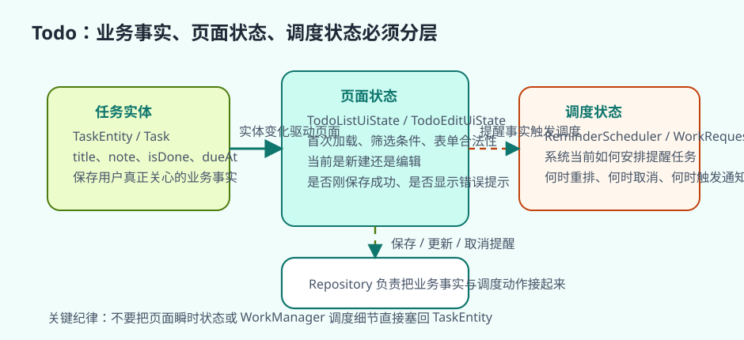
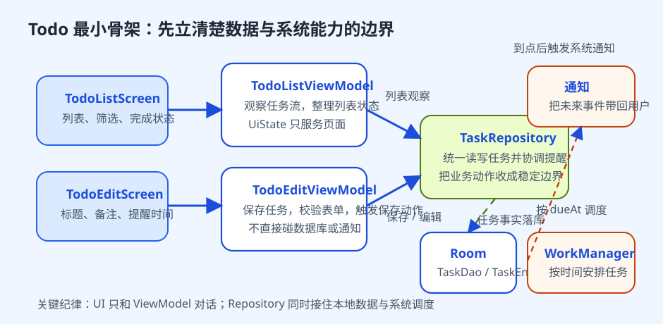

# Todo App

待办应用之所以适合作为 Android 综合案例，并不是因为它功能少，而是因为它恰好把很多真实能力压缩进了一个足够克制的产品里。你会碰到列表、表单、状态管理、本地存储、提醒、通知，甚至还可以继续往外扩展搜索、筛选、小组件和多设备同步。它不像聊天应用那样一开始就要求实时连接和高频状态变化，也不像大型内容分发应用那样天然依赖复杂远程数据策略，因此特别适合作为“第一章真正完整的小项目”。

更重要的是，Todo App 让读者第一次必须同时面对“页面怎么组织”“数据从哪里来”“状态应该放在哪”“后台任务如何接进系统能力”这几条主线。只要这几条线在一个小项目里被理顺，前面分散学过的 Room、ViewModel、Flow、WorkManager 和通知，就会第一次真正连成工程实践，而不再只是彼此独立的知识点。

## 学习目标

- 理解待办应用为什么适合作为现代 Android 综合案例的第一站。
- 学会从用户动作拆出页面状态、数据模型和后台提醒能力。
- 学会用 Room、ViewModel、StateFlow、WorkManager 和通知构成一个完整小项目。
- 建立“先立结构，再扩需求”的项目推进顺序。

## 前置知识

- 已理解 Room、ViewModel、StateFlow、Repository、WorkManager 和通知。
- 已完成基本列表页、表单页或局部业务练习。

## 正文

### 1. Todo App 真正训练的，不只是 CRUD

很多人第一次做综合项目，会把 Todo App 误解成“最基础的增删改查练习”。如果只是为了证明 Room 能写入、RecyclerView 能显示、按钮能点击，这种理解当然也说得通。但把 Todo App 只做成 CRUD 演示，恰恰会错过它最有价值的部分。它真正适合训练的是：一个小而完整的应用，如何把用户动作、页面状态、本地数据和后台能力组织成同一条稳定主线。

用户对待办应用的期望也很能说明问题。打开应用时，任务列表应该立刻可见；新建任务后，列表应立即更新；勾选完成不应依赖远程接口才能反馈；设置提醒后，应用即使退出，系统也应在合适时间把这件事重新带回用户面前。只要把这些需求认真看作产品承诺，而不只是页面功能，你就会发现 Todo App 训练的其实是一个完整 Android 应用的基本结构。

### 2. 更好的起点是用户动作，而不是数据库表

一开始就新建 `TodoEntity` 并不算错，但更稳妥的做法通常是先问：用户到底会做什么。对一个最小待办应用来说，核心动作通常包括创建任务、编辑任务、标记完成、删除任务，以及在需要时为任务设置提醒。只要先把这些动作定义清楚，后面的页面状态、数据结构和后台能力就更容易围绕真实产品语义组织起来。

反过来，如果一开始先围绕数据库字段设计项目，很容易很快写出一套“能增删改查”的结构，却说不清楚编辑页为什么需要单独状态、列表页为什么要区分首次加载和局部更新、提醒为什么不能直接写进页面点击逻辑里。也就是说，先定义动作，不只是为了产品思考更自然，更是为了让结构从一开始就服务于用户任务，而不是服务于表结构本身。

### 3. Todo App 为什么天然适合本地优先

待办应用最重要的体验之一，就是“打开就能立刻用”。用户不会接受列表页先等待网络返回，没网时完全不能记录任务，或者勾选完成后还要等服务器成功才看到反馈。这让 Todo App 天然适合用来训练本地优先思路。对这样一个项目来说，Room 不是附加缓存，而应更接近可信来源；Repository 不是形式化包裹，而是统一读写和协调提醒的入口；ViewModel 也不是为了“多活一会儿”，而是为了把列表页和编辑页状态稳定地承接起来。

这条主线一旦站稳，很多结构判断都会变得简单。列表页不需要直接等某个异步返回才能更新，而是观察本地任务流；编辑页保存成功后，不是手工把一条对象塞回前一个页面，而是由本地数据变化自然驱动列表更新；提醒能力也不再是页面的一次性副作用，而是围绕持久化任务事实做的后台调度。Todo App 之所以适合做第一综合案例，正是因为它能把“本地优先”这件事讲得非常具体。

### 4. 页面状态、实体模型和调度状态必须分开


Todo App 最值得训练的一件事，就是把不同层级的状态分开。任务实体只需要表达业务事实，例如标题、备注、完成状态和提醒时间；页面状态则要表达当前界面到底处于什么上下文，例如列表页是否首次加载、当前筛选条件是什么、编辑页现在是新建还是修改、表单是否合法、提醒设置是否刚刚更新成功。这些东西如果混在同一个对象里，项目很快就会退化成一大团互相覆盖的布尔值。

提醒能力还会进一步放大这种边界问题。任务实体保存的是“用户希望在什么时间被提醒”这条业务事实，而调度层真正管理的，是“系统当前怎样把这条事实映射成后台任务”。这两层如果混在一起，后面修改提醒时间、取消提醒、恢复数据或重新安排任务时就会很脆弱。更稳妥的做法，是让 Repository 先稳定保存任务和提醒时间，再由独立调度层根据任务 ID 安排或取消后台任务。这样，页面、数据库和 WorkManager 才不会互相覆盖职责。

### 5. 更适合教学的推进顺序，是先立结构，再加复杂度

综合项目最容易学偏的地方，就是还没把主线立稳，就急着往里塞大量功能。Todo App 更合理的推进顺序通常是分阶段的。第一阶段只做最小核心：列表页、编辑页和本地持久化。第二阶段再加入状态复杂度，例如搜索、筛选、排序、空态、错误态，以及列表和编辑页之间的数据回流。第三阶段才接系统能力，例如提醒、通知跳转和必要时的小组件或快捷方式。

这种顺序的价值，在于每一阶段都只验证一组清楚的判断。第一阶段验证的是本地数据和页面状态是否能形成闭环；第二阶段验证的是状态建模是否足够清晰；第三阶段验证的是系统能力能否在不破坏既有结构的前提下接入。如果一开始就把提醒、排序、过滤、同步和小组件全部一起接进来，项目会立刻显得“很丰富”，但读者很难判断自己到底是结构没立住，还是某个局部能力出了问题。

### 6. 为什么提醒功能是这个案例最好的进阶点

很多初学者会把提醒理解成“最后再加一个通知”。其实它恰恰是 Todo App 最有教学价值的升级点。因为只要接入提醒，你就必须把整条链路真正串起来：编辑页负责收集提醒时间，ViewModel 负责把它纳入页面状态和保存动作，Repository 负责把业务事实落到本地，调度层负责把这条事实转换成后台任务，最终再由通知系统在恰当时机把任务重新带回用户面前。

这件事之所以重要，不是因为通知本身很炫，而是因为它迫使你同时面对页面、数据、后台任务和系统组件的协作边界。页面不能直接假装自己能“记住未来某个时间点”，数据库也不该直接承担系统调度语义，WorkManager 更不该反过来成为任务事实的唯一来源。只要读者能在这个小项目里把提醒能力接稳，前面学到的并发、后台任务和通知章节就会第一次真正落地。

### 7. 一个更像真实项目的最小骨架


如果希望这个案例既足够小，又不会后面一扩展就推倒重来，一个很稳妥的最小骨架通常包含这些角色：`TaskEntity` 和 `TaskDao` 负责本地任务数据，`TaskRepository` 负责统一读写和提醒协调，`TodoListViewModel` 负责列表页状态，`TodoEditViewModel` 负责编辑页状态，`ReminderScheduler` 负责把业务事实转换成后台调度。重点不在于类名，而在于边界清楚：页面不直接碰数据库，提醒不直接写在页面回调里，页面状态也不直接等于持久化实体。

如果你不想一开始就上完整模块化，也可以先采用轻量目录结构，把 `feature/todo-list`、`feature/todo-edit`、`core/database`、`core/model`、`core/notification`、`core/work` 这几类代码区分开。这样做的价值并不只是看起来整齐，而是能帮助你从一开始就习惯把功能逻辑和基础设施能力分开。等项目以后真的增长起来，再把这些目录提升为真正的 Gradle 模块，也会自然得多。

如果把 Todo 的本地数据、页面状态和提醒触发收进同一组骨架代码，这个案例的主线会更清楚。

```kotlin
@Entity(tableName = "tasks")
data class TaskEntity(
    @PrimaryKey(autoGenerate = true) val id: Long = 0,
    val title: String,
    val dueAt: Long?,
    val isDone: Boolean,
)

@Dao
interface TaskDao {
    @Query("SELECT * FROM tasks ORDER BY isDone ASC, dueAt ASC")
    fun observeAll(): Flow<List<TaskEntity>>

    @Insert
    suspend fun insert(task: TaskEntity): Long

    @Query("UPDATE tasks SET isDone = :done WHERE id = :taskId")
    suspend fun updateDone(taskId: Long, done: Boolean)
}

class TaskRepository(
    private val taskDao: TaskDao,
    private val reminderScheduler: ReminderScheduler,
) {
    fun observeTasks(): Flow<List<TaskItemUiModel>> {
        return taskDao.observeAll().map { entities ->
            entities.map { entity ->
                TaskItemUiModel(entity.id, entity.title, entity.isDone, entity.dueAt)
            }
        }
    }

    suspend fun addTask(title: String, dueAt: Long?) {
        val taskId = taskDao.insert(TaskEntity(title = title, dueAt = dueAt, isDone = false))
        reminderScheduler.schedule(taskId = taskId, dueAt = dueAt)
    }
}
```

```kotlin
data class TodoUiState(
    val tasks: List<TaskItemUiModel> = emptyList(),
    val isAdding: Boolean = false,
)

class TodoViewModel(
    private val repository: TaskRepository,
) : ViewModel() {
    val uiState: StateFlow<TodoUiState> = repository.observeTasks()
        .map { items -> TodoUiState(tasks = items) }
        .stateIn(viewModelScope, SharingStarted.WhileSubscribed(5_000), TodoUiState())

    fun addTask(title: String, dueAt: Long?) {
        viewModelScope.launch {
            repository.addTask(title, dueAt)
        }
    }
}
```

这组代码把 Todo App 最值得练的三件事收到了同一条线上。Room 负责本地任务清单，Repository 把“保存任务”和“调度提醒”组合成同一个业务动作，ViewModel 则只把本地任务流翻译成页面状态。只要这三层站稳，Todo 就不会退化成“一个页面直接改数据库，再在按钮点击里顺手调起提醒”的耦合练习。

### 8. Todo 项目做完后，最该复盘的是结构而不是功能数量

Todo App 完成后，最有价值的复盘问题通常不是“还差不差标签、日历视图、云同步”，而是这个项目的结构到底有没有站稳。列表更新是不是依赖清晰的数据流，ViewModel 是否真的承接了页面状态，Room 是否已经成为可信来源，提醒是否由后台机制驱动而不是页面临时逻辑，这些问题比功能数更能决定这个案例有没有教学价值。

如果这些问题都能回答清楚，那么 Todo App 就已经完成了它最重要的使命：把本地数据、页面状态、后台调度和系统通知放回同一条工程主线。到那时，它就不再只是一个“待办列表 demo”，而是一个足够小、足够真、足够能复用判断方法的 Android 项目起点。后面再进入新闻应用、聊天应用或更复杂的架构样例时，你面对的虽然是不同业务，但组织复杂度的基本方法已经建立起来了。

### 9. 实践任务

起点条件：

- 已有一个空项目或基础应用骨架。

步骤：

1. 用一句话写出 Todo App 的产品定位，只保留核心动作。
2. 为列表页和编辑页分别定义 `UiState`，不要一开始就只画数据库表。
3. 用 Room 实现最小任务读写链路，并用 StateFlow 驱动列表刷新。
4. 在不引入提醒功能之前，先确保列表、新建、编辑、完成状态都能闭环。
5. 第二阶段再把提醒接入 WorkManager 与通知系统。

预期结果：

- 读者会真正完成一套“结构先行”的小项目。
- 读者会体会到本地优先和页面状态建模在真实案例里的价值。
- 读者会为更复杂项目建立可复用的项目组织方式。

自检方式：

- 读者应能解释为什么 Todo App 适合本地优先。
- 读者应能区分哪些信息属于实体，哪些属于页面状态。
- 读者应能说明为什么提醒功能更适合交给后台调度而不是页面逻辑。

调试提示：

- 列表和编辑页共享太多字段，优先重拆页面状态。
- 勾选完成后 UI 变化不稳定，优先检查可信数据来源是否唯一。
- 提醒只能在页面打开时生效，说明后台边界还没立住。

### 10. 常见误区

- 一开始就把案例做成大而全的任务管理系统。
- 只练数据库 CRUD，不认真设计页面状态。
- 把提醒逻辑直接写在页面层。
- 本地数据和 UI 状态混成一团。

## 小结

Todo App 最适合作为综合案例，不是因为它简单，而是因为它足够小、足够真、足够能把现代 Android 主线串起来。只要你能在这个案例里真正理清本地数据、页面状态、后台调度和系统通知的边界，后面面对更复杂的内容型应用和实时应用时，就已经具备了一套可靠的起步方法。

## 参考资料

- 参考并改写自：Damilola Panjuta、Linda Nwokike，《Tiny Android Projects Using Kotlin》(2024)，Todo 类项目与分阶段实现相关章节。
- 参考并改写自：Matt Bennett，《Scalable Android Applications in Kotlin and Jetpack Compose》(2025)，项目结构、状态边界与可扩展组织相关章节。
- 参考并改写自：`Clean Android Architecture`，UseCase、Repository 与系统能力协作相关章节。

- Room: <https://developer.android.com/training/data-storage/room>
- WorkManager overview: <https://developer.android.com/topic/libraries/architecture/workmanager>


