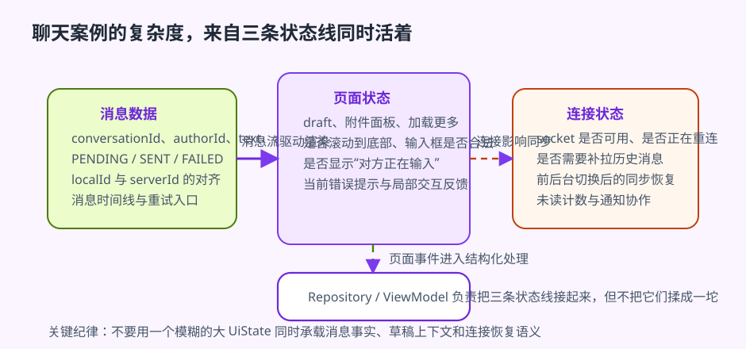
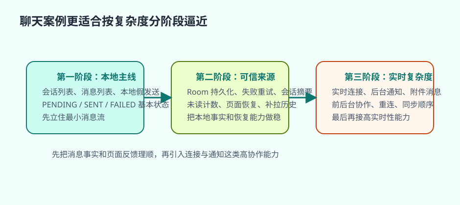

# 聊天应用

聊天应用之所以是高级综合案例，并不是因为界面看起来更像成熟社交产品，而是因为它把很多最难的工程问题集中到了一起。列表需要实时更新，输入框和附件面板本身就是状态系统，单条消息还会经历发送中、成功、失败和重试几种状态，后台又要处理未读计数、通知、连接恢复和离线缓存。也正因为如此，它并不适合作为第一套完整项目，却非常适合作为“当前面的基础架构已经建立后，如何面对更高复杂度状态和数据流”的训练场。

参考资料在处理这类案例时几乎都在强调同一件事：聊天应用不该从“气泡界面”开始，而应该从“状态系统”开始。本章也沿着这条线组织。重点不是做出一个像某家 IM 的页面，而是把聊天案例拆成一条更适合教材推进的实现顺序，让读者看清楚：为什么它比待办和新闻更复杂，复杂度又究竟来自哪些状态线和边界。

## 学习目标

- 理解聊天应用为什么比待办和新闻应用复杂一个层级。
- 理解消息流、连接状态、发送状态、通知和本地缓存之间的关系。
- 学会以“分阶段逼近”的方式设计聊天项目，而不是一步到位追求全功能。
- 能判断哪些问题属于页面状态，哪些属于消息数据和连接层。

## 前置知识

- 已理解列表、Room、Repository、ViewModel、Flow、通知和后台任务。
- 已完成至少一个本地优先或网络型综合案例。

## 正文

### 1. 聊天应用真正复杂的，是多条状态线同时活着

待办应用通常围绕任务数据组织，新闻应用更强调内容链路和远程、本地、页面之间的关系。聊天应用则更难，因为它不是只有一条主要数据流，而是多条状态线同时存在、同时变化。当前会话的消息列表是一条线，输入框和附件选择状态是一条线，单条消息的发送状态又是一条线，连接状态、未读状态、通知与前后台同步状态也都各自有自己的节奏。只要把这些线粗暴地压成一个“大状态对象”，项目很快就会失去可维护性。

这也是为什么聊天案例不能再被理解成“另一个 RecyclerView 项目”。它更像一个高复杂度状态系统。页面看到的只是消息气泡，但工程上真正困难的，是这些气泡背后同时存在的时间线、连接线、通知线和本地持久化线如何彼此协作而不互相污染。

### 2. 为什么先做本地消息系统，比先做实时连接更健康

很多人第一次写聊天案例，最先被 WebSocket、推送和实时连接吸引，结果从第一天起就被连接、重连、顺序、幂等和通知恢复压住。教材里更稳妥的推进方式通常反过来：先把本地消息系统做稳。也就是说，先确保会话列表能展示，消息列表能展示，用户发送时本地可以立即插入一条待发送消息，并且消息状态能够正确表达发送中、成功和失败。

这样做的价值非常实际。只要本地消息系统已经稳定，后面接实时连接时，复杂度就不再是“从零到一的混乱叠加”，而是在一条已经存在的状态主线上增加新的来源。反过来，如果连本地消息状态都还没理清，就直接接入实时通信，最终很容易把连接失败、消息失败、输入状态和页面状态全部揉成一团。

### 3. 消息数据、页面状态和连接状态必须分开



聊天项目里最常见的错误之一，就是把“消息内容”“页面状态”和“连接状态”混成一坨。例如消息数据本身应该关心的是谁发送、何时发送、是什么内容类型、当前同步状态如何、对应的消息标识是什么；页面状态则更关心输入框当前内容、是否正在加载更多、是否要显示“对方正在输入”、是否需要滚动到底部；连接状态关心的则是实时通道当前是否可用、是否正在重连、会话是否可同步。

这三类信息看起来都和“当前聊天页面”有关，但它们的生命周期和恢复方式完全不同。如果把它们混进一个模糊的错误态或一个过于巨大的 `UiState` 里，后面无论是做失败重试、滚动定位、媒体消息、通知恢复还是离线回放，都会越来越难维护。聊天案例最有价值的一点，恰恰是逼着你承认：共享的是会话事实，不是所有页面上下文。

### 4. 乐观更新是聊天体验的基本盘

聊天最差的体验之一，就是用户点了发送以后界面半天没有反应。因此，聊天案例几乎一定要尽早引入乐观更新。更健康的发送路径通常是：用户点击发送时，本地先插入一条临时消息，页面立即显示这条消息并标记为发送中；服务器确认后，再把它更新成发送成功；如果失败，则明确更新为失败，并保留重试入口。

这条策略看起来像是在优化体验，但它真正训练的是工程结构。只要你接受消息必须先以本地事实出现，就必须认真设计本地数据层、消息状态模型和 UI 反馈链。否则，发送动作永远只能停留在“等远程结果回来再决定页面怎么变”的旧模式里，聊天体验就很难成立。

一旦进入这条路线，还必须把临时消息 ID 和服务器正式消息 ID 分开。本地待发送消息需要一个稳定的本地标识，才能支撑重试、去重和状态替换；服务器确认后返回的正式消息 ID，则负责和远端事实对齐。如果这两层 ID 没拆开，最常见的问题就是重复气泡、发送成功后列表跳动，或者重试时无法准确替换旧消息。聊天项目真正棘手的地方，往往就藏在这种“看起来只是多一个字段”的状态约束里。

### 5. 为什么不能把所有失败都做成一种错误提示

聊天项目里很容易偷懒的一点，是把“断线了”“某条消息发送失败”“页面加载失败”全部做成一种错误。这样看似统一，实际却会让用户和系统都不知道接下来该怎么恢复。更成熟的做法，是明确区分：连接状态影响整段会话是否可实时同步，消息状态影响单条消息是否需要重试，页面状态则影响当前查看体验，例如是否正在加载更多、是否需要显示历史记录错误提示。

排序问题也属于同一类边界。聊天页面看到的是一条有先后关系的时间线，但这条时间线里可能同时存在本地待发送消息、服务器已确认消息和补拉回来的历史消息。如果排序规则只依赖“当前收到的顺序”，而没有明确按本地创建时间、服务器时间戳或确认后的最终顺序来收敛，列表就会频繁抖动。聊天列表不是普通的静态列表，它是带一致性要求的消息时间线。只要读者先意识到这一点，后面面对同步和重连时就更容易保持结构清醒。

### 6. 通知在聊天场景里不是外围能力，而是主线能力

聊天应用和很多其他应用最大的不同，在于前台与后台体验差异极大。前台时，用户依赖页面内实时流更新；后台时，用户则往往依赖通知得知新消息。这意味着通知不能等到案例最后再“临时补一个”，而应该从设计阶段就纳入考虑。什么时候该发通知，前台和后台如何避免重复提醒，点击通知后如何恢复到正确会话上下文，这些都属于聊天主线，而不是外围装饰。

如果这部分后置，前台体验、后台体验和消息状态就很容易互相打架。最常见的后果就是：前台已经看到消息却仍然重复弹通知，后台点进通知又回不到正确会话，或者未读计数和消息已读状态彼此不同步。聊天案例之所以比新闻应用更复杂，不只是因为多了一个实时连接，而是因为系统通知也被拉进了主线协作里。

### 7. 更适合教材的迭代顺序，是先立本地主线，再接实时复杂度



对于教学型聊天项目，更稳妥的推进路径通常是分阶段逼近。第一阶段先做会话列表、消息列表和本地模拟发送，把最小消息流和发送状态主线站稳。第二阶段再加入 Room 持久化、发送失败与重试、未读计数和会话摘要，让本地事实和状态恢复变得可靠。第三阶段才真正接入实时连接、后台通知与图片或文件等附件消息。

这种顺序的好处不是“实现起来更轻松”这么简单，而是每一步都只验证一类复杂度。第一阶段验证的是消息状态模型；第二阶段验证的是本地可信来源和恢复能力；第三阶段才开始验证实时连接、通知和多类型消息带来的高复杂度协作。如果第一天就把实时连接、通知、未读、媒体附件和消息重试一起接进来，读者就很难判断自己到底是状态模型有问题，还是某个系统能力还没接稳。

### 8. 一个教学聊天案例最值得保护的结构点

聊天案例最后最值得检查的，并不是界面有没有做出某个商业 IM 的视觉效果，而是结构点有没有站稳。消息流是否以本地可信来源为中心，单条消息状态是否可追踪，会话页状态和消息数据是否已经分开，通知和前台状态是否能一致协作，这几件事比“界面像不像真实产品”更能决定这个案例有没有真正的工程价值。

如果把本地消息、乐观更新和通知入口写到同一组骨架里，聊天项目的复杂度来源会更清楚。

```kotlin
enum class MessageSyncState { PENDING, SENT, FAILED }

@Entity(tableName = "messages")
data class MessageEntity(
    @PrimaryKey val localId: String,
    val conversationId: String,
    val text: String,
    val authorId: String,
    val createdAt: Long,
    val syncState: MessageSyncState,
)

class ChatRepository(
    private val messageDao: MessageDao,
    private val chatApi: ChatApi,
) {
    fun observeConversation(conversationId: String): Flow<List<MessageUiModel>> {
        return messageDao.observeMessages(conversationId).map { entities ->
            entities.map { entity ->
                MessageUiModel(entity.localId, entity.text, entity.authorId, entity.syncState)
            }
        }
    }

    suspend fun sendMessage(conversationId: String, text: String, authorId: String) {
        val localId = UUID.randomUUID().toString()
        val pending = MessageEntity(localId, conversationId, text, authorId, System.currentTimeMillis(), MessageSyncState.PENDING)
        messageDao.insert(pending)

        when (chatApi.sendMessage(conversationId, text, localId)) {
            is ApiResult.Success -> messageDao.updateSyncState(localId, MessageSyncState.SENT)
            else -> messageDao.updateSyncState(localId, MessageSyncState.FAILED)
        }
    }
}
```

```kotlin
class ChatViewModel(
    private val repository: ChatRepository,
    savedStateHandle: SavedStateHandle,
) : ViewModel() {
    private val conversationId: String = checkNotNull(savedStateHandle["conversationId"])
    private val _draft = MutableStateFlow("")
    val draft: StateFlow<String> = _draft.asStateFlow()

    val messages: StateFlow<List<MessageUiModel>> = repository.observeConversation(conversationId)
        .stateIn(viewModelScope, SharingStarted.WhileSubscribed(5_000), emptyList())

    fun onDraftChanged(value: String) {
        _draft.value = value
    }

    fun onSendClicked(authorId: String) {
        val content = _draft.value.trim()
        if (content.isEmpty()) return

        viewModelScope.launch {
            repository.sendMessage(conversationId, content, authorId)
            _draft.value = ""
        }
    }
}
```

这组代码把聊天项目最容易被低估的三条状态线写成了具体结构。消息内容走本地数据库流，发送状态通过 `PENDING/SENT/FAILED` 明确暴露，输入框草稿则作为独立页面状态存在。只要这三条线分开，聊天界面就不会再把“连接失败”“发送失败”“输入框内容”“列表渲染”粗暴混成一个大而空泛的错误态。

这也是为什么聊天应用比新闻应用更难，但又不是另一种完全陌生的问题。你仍然需要本地可信来源和页面状态建模，只是现在多了乐观更新、失败回落和通知入口这些高实时性要求。把这些状态线提早拆开，整个案例才有机会长成真实项目，而不是一页静态消息列表。

### 9. 实践任务

起点条件：

- 已具备列表、Room、ViewModel、Repository 和通知基础。

步骤：

1. 先设计消息实体、会话摘要实体和会话页面 `UiState`。
2. 用本地假数据和假发送实现搭一条最小消息流。
3. 接入发送中 / 成功 / 失败状态和重试路径。
4. 为后台通知设计最小跳转恢复方案。
5. 最后再评估是否需要引入实时连接和附件消息。

预期结果：

- 读者会把聊天应用看成高复杂度状态系统，而不只是消息气泡界面。
- 读者应能清楚地区分消息数据、页面状态和连接状态。
- 读者会建立一条更适合逐步扩展的聊天项目骨架。

自检方式：

- 读者应能解释聊天应用为什么比新闻应用复杂。
- 读者应能判断哪些信息属于消息数据，哪些属于页面状态。
- 读者应能说明通知为什么在聊天场景里属于主线能力。

调试提示：

- 一切状态都混在消息列表里，优先先拆数据层和页面层。
- 用户发送后界面没有即时反馈，优先建立乐观更新。
- 前台和后台都重复提醒，说明通知与页面协作边界不清楚。

### 10. 常见误区

- 把聊天案例简化成只有静态消息列表。
- 不分消息状态、连接状态和页面状态。
- 没有本地缓存却试图做顺滑聊天体验。
- 把通知和后台到达当成最后再补的外围功能。

## 小结

聊天应用真正训练的，是高复杂度状态下的数据流与系统协作能力。只要你能把消息数据、页面状态、连接状态、通知和本地缓存真正拆开并重新组织，这个案例就会成为从普通内容应用迈向复杂交互应用的重要台阶。

## 参考资料

- 参考并改写自：Damilola Panjuta、Linda Nwokike，《Tiny Android Projects Using Kotlin》(2024)，聊天类项目与功能拆分相关章节。
- 参考并改写自：Matt Bennett，《Scalable Android Applications in Kotlin and Jetpack Compose》(2025)，高复杂度状态、消息流与工程边界相关章节。
- 参考并改写自：`Clean Android Architecture`，状态分层、错误语义与复杂交互项目组织相关章节。

- Now in Android: <https://github.com/android/nowinandroid>
- Offline-first architecture: <https://developer.android.com/topic/architecture/data-layer/offline-first>

